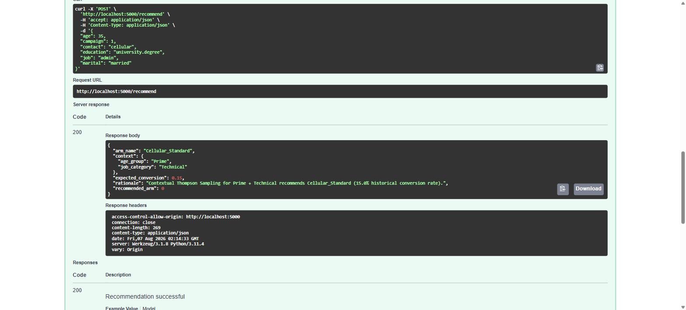
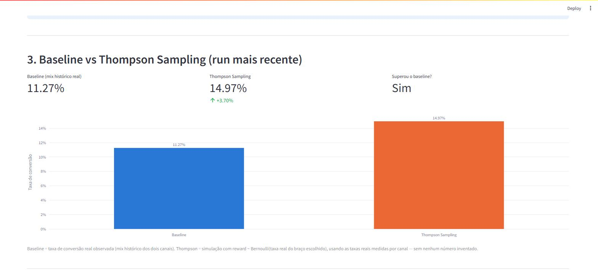

# Checklist do demo day — item a item

Guia rápido para avaliação, seguindo o checklist oficial do edital ("Checklist antes do demo
day"). Cada item tem como foi feito e a evidência (arquivo ou print — os dashboards não
precisam ser executados para conferir). Não substitui o [`README.md`](README.md), que continua
sendo a documentação principal do projeto; este arquivo só organiza a correção item a item.

## 1. Repositório organizado com código e dependências

`requirements.txt` na raiz lista as dependências; código em `src/datathon/` (bandit, API, ETL,
quality, validation) e `scripts/` (treino, avaliação, retraining). Testes em `tests/`.

## 2. Notebook de EDA com a base Kaggle limpa e referenciada

[`notebooks/datathon_main.ipynb`](notebooks/datathon_main.ipynb). Base:
[bank-marketing (UCI/Kaggle, henriqueyamahata)](https://www.kaggle.com/datasets/henriqueyamahata/bank-marketing),
linkada também no `README.md`. A coluna `duration` é removida do notebook por vazamento temporal
(só é conhecida depois da ligação).

## 3. Baseline e Modelo Adaptativo implementados e comparados

Baseline (mix histórico real, sem contexto): **11,27%**. Thompson Sampling: **14,97%**
(**+3,70 p.p.**). Reproduzível com `compute_baseline_vs_thompson()` em
[`src/datathon/bandit/contextual_thompson.py`](src/datathon/bandit/contextual_thompson.py) e no
notebook. Detalhamento e por que Thompson Sampling foi escolhido (em vez de Epsilon-Greedy/UCB)
em [`docs/DECISOES_THOMPSON_E_ARMS.md`](docs/DECISOES_THOMPSON_E_ARMS.md).

## 4. 5 casos de teste (Golden Set)

[`data/golden_set/golden_set.json`](data/golden_set/golden_set.json) e a tabela "Golden set — 5
perfis validados" no [`README.md`](README.md#golden-set--5-perfis-validados): 5 perfis de cliente,
a oferta recomendada para cada um e por que faz sentido (ex.: aposentado sênior → melhor
conversão, 47,5%).

## 5. Código executável que retorna a predição

`POST /recommend` (Flask + Swagger, `src/datathon/api/app.py`). Testado ao vivo em
`http://localhost:5000/apidocs` — perfil de exemplo (35 anos, admin, casado, celular) devolve
`Cellular_Standard` com 15% de conversão esperada:

## 6. README com link da base, parágrafo de infraestrutura cloud e instruções de execução

Tudo no [`README.md`](README.md): link do Kaggle (seção "Dataset"), instruções de instalação e
execução local (seção "Instalação e execução") e arquitetura de nuvem (seção "Arquitetura",
detalhada em [`docs/ARQUITETURA.md`](docs/ARQUITETURA.md) com AWS, Azure e GCP — o edital só pede
AWS, os outros dois são além do mínimo).

## 7. Tracking de experimentos via MLflow

`.mlflow/mlflow.db` (SQLite local), gravado por `scripts/train_with_mlflow.py` e
`scripts/retrain_model.py`. Evidência navegável sem precisar rodar nada, direto do tracking
store real (não é mockado):

Para reproduzir: `streamlit run app_mlflow_showcase.py`, ou `mlflow ui --backend-store-uri
sqlite:///.mlflow/mlflow.db`.

## 8. Vídeo de apresentação (até 5 min)

Roteiro cronometrado pronto em
[`docs/ROTEIRO_APRESENTACAO.md`](docs/ROTEIRO_APRESENTACAO.md) — cobre problema de negócio,
dados, como o modelo decide, demo ao vivo da API, canary deploy, validação e nuvem. Gravação
ainda pendente.

---

Os dois itens abaixo não fazem parte do checklist oficial do edital — são material extra pra
facilitar a correção.

## 9. Arquitetura

Documentação completa de arquitetura-alvo em nuvem, além do mínimo pedido (o edital só exige
"um ou dois parágrafos sobre AWS" — o projeto documenta três nuvens em profundidade):

- [`docs/ARQUITETURA.md`](docs/ARQUITETURA.md) — visão geral, desenho mínimo vs. automatizado,
  qual nuvem escolher e por quê, governança e segurança
- [`docs/architecture/AWS.md`](docs/architecture/AWS.md) — S3, Lambda, App Runner, CloudWatch,
  custo real por serviço com fonte oficial
- [`docs/architecture/AZURE.md`](docs/architecture/AZURE.md) — Blob Storage, Azure Functions,
  App Service, Application Insights, custo real
- [`docs/architecture/GCP.md`](docs/architecture/GCP.md) — Cloud Storage, Cloud Run Jobs, Cloud
  Run (com traffic splitting nativo pro canary deploy), Cloud Logging/Monitoring, custo real

Resumo: dados e modelo são pequenos (poucos KBs) e o treino roda em segundos, então a arquitetura
é serverless/PaaS enxuta nas três nuvens — sem clusters de treino gerenciados, que seriam
desproporcionais ao tamanho real do problema. Cenário acadêmico cabe essencialmente no free tier
nas três; GCP Cloud Run é o mais barato em cenário de maior tráfego e tem o mecanismo de canary
deploy mais direto (traffic splitting nativo entre revisions).

## 10. Dashboards

4 dashboards Streamlit, cada um com um propósito diferente (detalhes completos na seção
[Dashboards do README](README.md#dashboards)). Nenhum precisa da API rodando, exceto o de canary.
Local, portas padrão usadas nesta sessão (a primeira instância sobe em 8501; instâncias
adicionais simultâneas sobem automaticamente na próxima porta livre):

| Dashboard | Link local | O que mostra |
|---|---|---|
| `app_canary_arm_swap_demo.py` | [localhost:8501](http://localhost:8501) | Caso real de canary deploy: retreino com mais dados troca a oferta vencedora pro segmento Young_Technical (Email_Campaign → Cellular_Standard). Único que precisa da API (`python src/datathon/api/app.py`) rodando |
| `app_mlflow_showcase.py` | [localhost:8502](http://localhost:8502) | Runs reais do MLflow (`.mlflow/mlflow.db`), gráfico baseline vs. Thompson direto do tracking store — evidência da Etapa 7 sem precisar abrir o MLflow UI |
| `app_dashboard.py` | [localhost:8503](http://localhost:8503) | Visão de ponta a ponta do pipeline: dados processados, treino, avaliação por contexto e simulação de recomendações |
| `app_dashboard_pt.py` | [localhost:8504](http://localhost:8504) | Qualidade de dados ao vivo, métricas do modelo, testes estatísticos (IC, chi-square) e a página "Thompson Aprende?", que explica de onde vem a incerteza do modelo |

Para reproduzir: `streamlit run <arquivo>.py` a partir da raiz do repo.