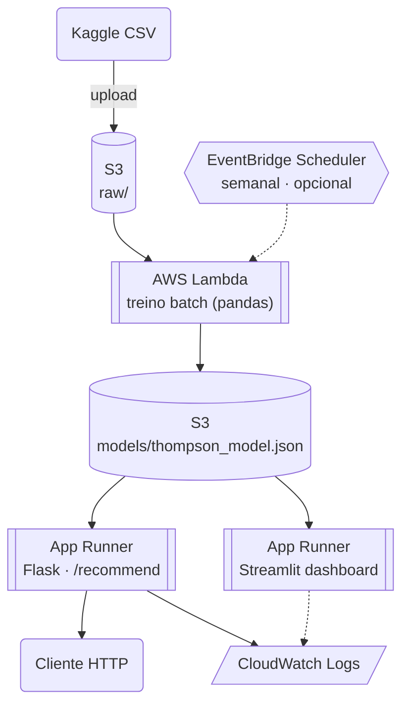
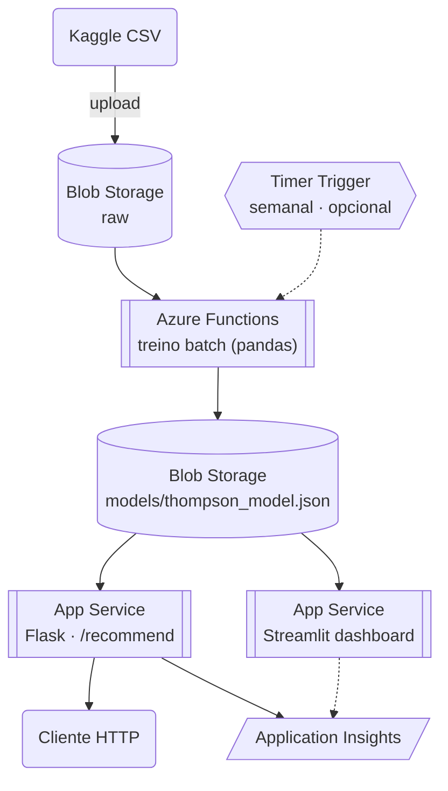
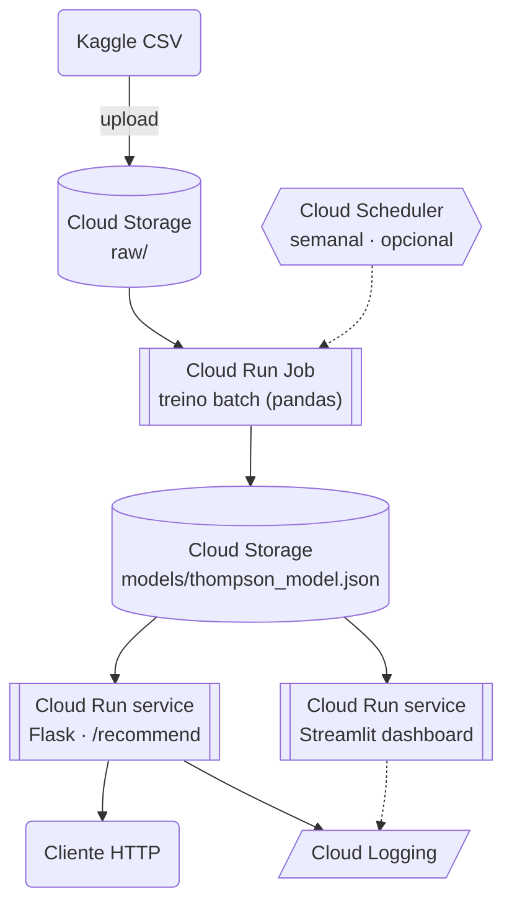

# Arquitetura

## Local (desenvolvimento)

```
Ambiente local
├── Python scripts (ETL + treino)
├── MLflow local (SQLite, .mlflow/mlflow.db)
├── Flask API (porta 5000) — POST /recommend
└── Streamlit dashboard (app_dashboard.py)
```

Tudo roda localmente, sem custo, sem configuração de nuvem. `src/datathon/config.py` já define
um `Environment` (LOCAL / AWS / AZURE) que troca o storage e o tracking automaticamente — o
código já foi escrito pensando no mapeamento abaixo.

## Por que essa arquitetura de nuvem

O sistema é pequeno por natureza: dados em `data/processed/` na casa dos KBs, modelo Thompson
Sampling salvo como um JSON de ~5KB, treino em segundos, API stateless. Por isso a arquitetura-alvo
é serverless/PaaS enxuta — **não** clusters de treino gerenciados (SageMaker Training Jobs, Azure
ML Compute Clusters), que seriam desproporcionais ao tamanho real do problema.

## AWS

Desenho completo, com diagrama detalhado e custo por serviço (fonte oficial + data de
consulta): [`docs/architecture/AWS.md`](architecture/AWS.md)



| Necessidade | Serviço | Papel |
|---|---|---|
| Dados (raw, processado, modelo) | **S3** | um bucket, prefixos `raw/`, `processed/`, `models/` |
| Treino/pipeline batch | **Lambda** | roda `train_with_mlflow.py`, segundos, sem SageMaker |
| API | **App Runner** | container Flask, HTTPS gerenciado, `/recommend` |
| Dashboard | **App Runner** | segundo serviço, mesmo padrão, serve o Streamlit |
| Experiment tracking | **MLflow + S3** | backend de artifacts no bucket |
| Logs | **CloudWatch** | nativo de Lambda/App Runner |
| Credenciais | **IAM Role** | permissão restrita ao bucket, nunca chaves fixas |

## Azure

Desenho completo, com diagrama detalhado e custo por serviço (fonte oficial + data de
consulta): [`docs/architecture/AZURE.md`](architecture/AZURE.md)



| Necessidade | Serviço | Papel |
|---|---|---|
| Dados (raw, processado, modelo) | **Blob Storage** | containers `raw`, `processed`, `models` |
| Treino/pipeline batch | **Azure Functions** | plano Consumption, dispensa Azure ML Compute Cluster |
| API | **App Service** | Web App for Containers, Flask `/recommend` |
| Dashboard | **App Service** | segundo Web App, mesmo plano, serve o Streamlit |
| Experiment tracking | **Azure ML Workspace** | endpoint MLflow-compatible nativo (já é dependência do projeto: `azureml-mlflow`) |
| Logs | **Application Insights** | anexado nativamente ao App Service |
| Credenciais | **Managed Identity** | RBAC restrito ao container |

## GCP

Desenho completo, com diagrama detalhado e custo por serviço (fonte oficial + data de
consulta): [`docs/architecture/GCP.md`](architecture/GCP.md)



| Necessidade | Serviço | Papel |
|---|---|---|
| Dados (raw, processado, modelo) | **Cloud Storage** | um bucket, prefixos `raw/`, `processed/`, `models/` |
| Treino/pipeline batch | **Cloud Run Jobs** | roda a lógica de `retrain_model.py`, segundos, sem Vertex AI Training |
| API | **Cloud Run (service)** | mesmo container Flask, HTTPS gerenciado automaticamente, `/recommend` |
| Dashboard | **Cloud Run (service)** | segundo serviço, mesmo padrão, serve o Streamlit |
| Experiment tracking | **Cloud Monitoring + manifesto JSON no Cloud Storage** | substitui o MLflow SQLite local (sem serviço gerenciado de MLflow nativo e sem custo na GCP) |
| Logs | **Cloud Logging** | nativo do Cloud Run |
| Credenciais | **Service account + Workload Identity Federation** | permissão restrita ao bucket/serviço, nunca chave JSON exportada |

O diferencial da GCP neste projeto não é custo nem integração — é o **canary deploy**: o Cloud Run
tem *traffic splitting* nativo entre *revisions* do mesmo serviço (`gcloud run services
update-traffic --to-revisions REV1=95,REV2=5`), sem precisar de um segundo recurso de borda (como o
API Gateway + alias de Lambda da AWS) nem de um tier pago só para habilitar o mecanismo (como os
*deployment slots* da Azure, que exigem App Service Standard/Premium). Ver
[`docs/architecture/GCP.md`](architecture/GCP.md) seção 4 para o levantamento comparativo completo.

## Governança e segurança

- **Credenciais**: nunca chaves fixas — IAM Role (AWS) ou Managed Identity (Azure).
- **LGPD**: ver [`docs/LGPD_PLAN.md`](LGPD_PLAN.md). Nenhum identificador de cliente é
  armazenado; logs de recomendação (quando implementados) reteriam apenas contexto agregado
  (`age_group` × `job_category`) por 90 dias.
- **Model drift**: monitorar a taxa de conversão observada vs. esperada por contexto; se cair
  de forma sustentada, é sinal para retreinar.
