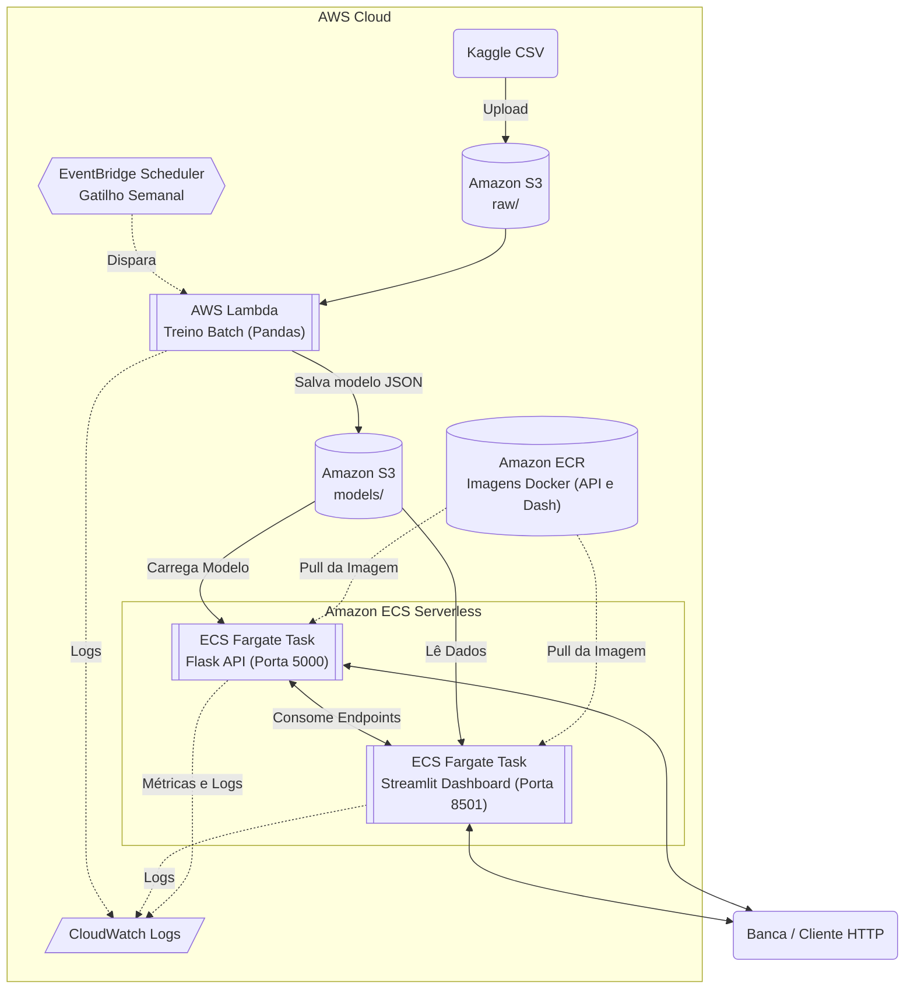

# Arquitetura de Referência — AWS

**Projeto:** Datathon FIAP G37 — recomendador de campanha por Thompson Sampling contextual  
**Autor do desenho:** Grupo 37  
**Data da elaboração:** 2026-08-12  
**Região de referência:** `us-east-1` (N. Virgínia) — todos os preços citados são desta região

> **Nota de método.** Este documento é um desenho de referência, atualizado para refletir a infraestrutura real provisionada para o projeto. As decisões de serviço foram tomadas a partir do código real deste repositório (`src/datathon/api/app.py`, `scripts/retrain_model.py`, `src/datathon/config.py`) e toda estimativa de custo vem de fonte oficial AWS com URL. Onde não foi possível confirmar um preço, isso está declarado explicitamente.

---

## 1. Visão geral

O sistema é um serviço de decisão de baixa latência e altíssima leveza: a API Flask (`/recommend`) carrega em memória um modelo de 12 bandits Beta-Bernoulli persistido como um JSON de **4,8 KB** (`data/models/thompson_model.json`), e responde qual das 4 campanhas oferecer a um perfil (`age_group` × `job_category`). O retreino (`scripts/retrain_model.py`) lê um parquet de **171 KB** com ~41 mil linhas e roda um laço de atualização de posteriors em segundos.

A arquitetura-alvo moderna é **baseada em contêineres serverless**: Amazon ECS (Fargate) para hospedar tanto a API quanto o Dashboard (Streamlit), Amazon ECR para o registro das imagens imutáveis, S3 como única camada de dados/artefatos, EventBridge Scheduler + Lambda para o retreino batch, e CloudWatch para observabilidade. A decisão já registrada de **não** usar SageMaker Training/Processing Jobs é mantida e reforçada aqui.

---

## 2. Diagrama de arquitetura



**Leitura do fluxo em uma frase:** o cliente interage com os contêineres hospedados no ECS Fargate (API e Dashboard), cujas imagens são puxadas do ECR, utilizando o S3 para leitura do modelo treinado assincronamente por uma rotina Lambda agendada, com logs nativamente escoados para o CloudWatch.

---

## 3. Seleção de serviços e por quê

| **Necessidade** | **Serviço AWS** | **Papel no desenho** | **Por que este e não uma alternativa mais pesada** |
|---|---|---|---|
| Registro de contêineres | **Amazon ECR** | Armazena as imagens Docker imutáveis da API e do Dashboard | Garante que o ambiente local e de produção sejam idênticos, sem compilações em runtime. |
| Serving do modelo e UI | **Amazon ECS (Fargate)** | Hospeda os contêineres Flask e Streamlit | Arquitetura serverless para execução contínua sem provisionamento de servidores EC2. |
| Retreino batch | **Lambda (imagem de contêiner)** | Roda a lógica de retreino | Treino de ~41 mil linhas em segundos cabe folgadamente no limite de 15 min da Lambda. **SageMaker Training Job** cobraria provisionamento de instância desproporcional. |
| Armazenamento de dados e modelos | **S3** | Bucket único com prefixos `raw/`, `processed/`, `models/` | Volume total real de dezenas de MB. Versionamento de bucket dá rollback de modelo sem infraestrutura adicional. |
| Gatilho de retreino | **EventBridge Scheduler** | `cron` semanal | Invocação serverless adequada à escala do projeto. **MWAA (Airflow)** seria desproporcional. |
| Experiment tracking | **MLflow (embutido/S3)** | Rastreia métricas (MLflow Showcase) | SageMaker managed MLflow seria desproporcional à escala do projeto. |
| Logs, métricas e alarmes | **CloudWatch** | Logs via `awslogs` driver | Nativo de Lambda e ECS, sem agente adicional. |

### 3.1 O que foi deliberadamente descartado

| **Serviço** | **Por que não** |
|---|---|
| **AWS App Runner** | **Está fechado para novos clientes.** A documentação oficial declara a descontinuação para novos perfis. A migração foi feita para **Amazon ECS Express Mode (Fargate)**. |
| **SageMaker Training / Endpoints** | O treino roda em segundos sobre 171 KB. Uma instância 24/7 de inferência para servir um JSON de 4,8 KB geraria custos desproporcionais. |

---

## 4. Estratégia de Deploy e Canary

### 4.1 Cenário Atual (Acadêmico/MVP)

No momento, a API Flask e o Streamlit Dashboard rodam expostos via **IP Público** diretamente no ECS Fargate para permitir avaliação simplificada da banca.

- O canary deploy de modelo é feito de forma **in-memory** pelo próprio código Python (`app.py`), gerenciando o split de tráfego, contadores em memória e a avaliação via teste qui-quadrado (`/canary/metrics`).

### 4.2 Evolução para Produção (ECS Nativo)

Para evoluir essa arquitetura a um ambiente de fintech real:

- O IP público seria substituído por um **Application Load Balancer (ALB)**.
- O Canary deploy em memória seria substituído pelo **Canary nativo do ECS** (via *weighted target groups* no ALB), roteando tráfego de forma ponderada entre *Tasks* executando imagens diferentes (vN e vN+1).

---

## 5. Segurança e governança

### 5.1 IAM com privilégio mínimo

| **Role** | **Principal** | **Permissões (escopo de recurso, não `*`)** |
|---|---|---|
| `ecsTaskExecutionRole` | `ecs-tasks.amazonaws.com` | `ecr:GetDownloadUrlForLayer`, `ecr:BatchGetImage`, `logs:CreateLogStream`, `logs:PutLogEvents`. |
| `datathon-api-task-role` | `ecs-tasks.amazonaws.com` | `s3:GetObject` em `models/*`. **Sem** `s3:PutObject`. |
| `datathon-retrain-role` | `lambda.amazonaws.com` | `s3:GetObject` em `raw/*` e `processed/*` · `s3:PutObject` em `models/*`. |

### 5.2 Dados em repouso e em trânsito

- **S3:** Block Public Access habilitado; criptografia SSE-S3; versionamento ligado.
- As portas `5000` (API) e `8501` (Dashboard) foram restritas no **Security Group** do cluster.
- **Segredos:** configurados estritamente via variáveis de ambiente nas definições de tarefa (*Task Definitions*) do ECS.

---

## 6. Observabilidade

### 6.1 Métricas nativas

| **Origem** | **Uso** |
|---|---|
| ECS Fargate | Monitoramento de uso de CPU e memória (limites rígidos de 1 vCPU / 3 GB RAM definidos por tarefa). |
| Lambda | `Invocations`, `Errors`, `Duration` para comparar a saúde técnica do pipeline de retreino. |

### 6.2 Logs

Um log group configurado no ECS via driver de log `awslogs`, garantindo retenção e análise centralizada.

---

## 7. CI/CD e automação

```text
push em main
  └─ GitHub Actions / Terminal Local
       ├─ ruff check + pytest
       ├─ docker build -f Dockerfile.*
       ├─ docker push para Amazon ECR
       └─ AWS ECS Force New Deployment
            └─ Atualiza os contêineres em produção
```

---

## 8. Estimativa de custos (Cenário ECS Fargate)

A arquitetura baseada em contêineres 24/7 gera um custo fixo básico diferente do Lambda puro, justificado pela necessidade do processo contínuo da API Flask e da interface Streamlit.

| **Item** | **Cálculo** | **US$/mês (Estimativa)** |
|---|---|---:|
| ECS Fargate (API) | 730 h × (1 vCPU × $0,04048 + 3 GB × $0,004445) | ~**$39,28** |
| ECS Fargate (Dashboard) | 730 h × (1 vCPU × $0,04048 + 3 GB × $0,004445) | ~**$39,28** |
| Amazon ECR | 2 GB × $0,10 | **$0,20** |
| Lambda retrain | 4,3 execuções (Free tier) | **$0,00** |
| S3 (Armazenamento) | 0,05 GB × $0,023 | **$0,00** |
| **Total estimado** | | **≈ US$ 78,76 / mês** |

> **Nota:** para um datathon onde os serviços ficam de pé apenas por alguns dias, o custo real medido será uma fração muito pequena deste total (alguns centavos/dólares por dia).

---

## 9. Limitações e próximos passos

| **Limitação** | **Detalhe** |
|---|---|
| **ALB e domínio customizado** | Atualmente utilizando IP público do Fargate. IPs públicos podem mudar em caso de restart da task. Solução futura: adoção de ALB e Route 53. |
| **Canary em memória vs. nuvem** | A troca do modelo ocorre internamente no Python. Em produção pesada, usar target groups HTTP no Application Load Balancer. |
| **Conversão assíncrona** | O projeto avalia a conversão com `random.random()` na demo local. Em produção real, o desfecho exigiria um endpoint `/outcome` de conciliação. |