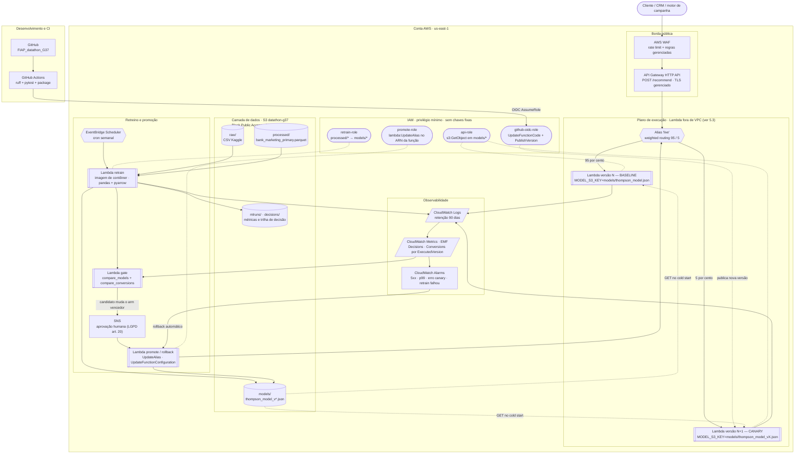

# Arquitetura de Referência — AWS

**Projeto:** Datathon FIAP G37 — recomendador de campanha por Thompson Sampling contextual
**Autor do desenho:** Grupo 37
**Data da elaboração:** 2026-08-04
**Região de referência:** `us-east-1` (N. Virgínia) — todos os preços citados são desta região

> **Nota de método.** Este documento é um desenho de referência, não um relatório de infraestrutura
> existente. Nada aqui está provisionado. Toda decisão de serviço foi tomada a partir do código real
> deste repositório (`src/datathon/api/app.py`, `scripts/retrain_model.py`, `src/datathon/config.py`)
> e toda estimativa de custo vem de fonte oficial AWS com URL e data de consulta na seção 8. Onde não
> foi possível confirmar um preço, isso está declarado explicitamente em vez de estimado.

---

## 1. Visão geral

O sistema é um serviço de decisão de baixa latência e altíssima leveza: a API Flask (`/recommend`)
carrega em memória um modelo de 12 bandits Beta-Bernoulli persistido como um JSON de **4,8 KB**
(`data/models/thompson_model.json`), e responde qual das 4 campanhas oferecer a um perfil
(`age_group` × `job_category`). O retreino (`scripts/retrain_model.py`) lê um parquet de **171 KB**
com ~41 mil linhas, roda um laço de atualização de posteriors em segundos, sem GPU e sem compute
distribuído. A arquitetura-alvo, portanto, é **serverless pura**: API Gateway HTTP API + Lambda para
o serving, S3 como única camada de dados/artefatos, EventBridge Scheduler + Lambda para o retreino,
e CloudWatch para observabilidade. A decisão já registrada em `docs/ARQUITETURA.md` de **não** usar
SageMaker Training/Processing Jobs é mantida e reforçada aqui — nesta seção do desenho o custo de
orquestração de um job gerenciado seria maior que o custo de computação que ele orquestra. A única
peça que exige projeto cuidadoso é o **canary deploy**: o padrão já implementado em memória na API
precisa virar roteamento ponderado de infraestrutura, e o mecanismo AWS correto para isso não é
óbvio (seção 4).

---

## 2. Diagrama de arquitetura



**Leitura do fluxo em uma frase:** o cliente entra por WAF → API Gateway → alias `live` da Lambda,
que divide o tráfego entre duas versões imutáveis da mesma função — cada uma apontando para um
arquivo de modelo diferente no S3 — enquanto o CloudWatch separa as métricas por versão executada e
alimenta tanto o gate estatístico de promoção quanto o alarme de rollback automático.

---

## 3. Seleção de serviços e por quê

| Necessidade | Serviço AWS | Papel no desenho | Por que este e não uma alternativa mais pesada |
|---|---|---|---|
| Entrada HTTPS pública | **API Gateway HTTP API** | TLS gerenciado, throttling, logs de acesso, integração nativa com alias de Lambda | HTTP API custa **$1,00/milhão** contra **$3,50/milhão** do REST API (3,5×). O REST API só se justificaria se precisássemos de canary *stages*, cache de stage ou modelos de request — e a seção 4 mostra que o canary fica melhor na Lambda. ALB seria pior: cobra ~$16/mês fixos mesmo com tráfego zero |
| Serving do modelo | **AWS Lambda** (pacote zip + AWS Lambda Web Adapter) | Executa o Flask de `src/datathon/api/app.py` sem reescrever para handler | O trabalho por requisição é sortear 4 amostras Beta com numpy sobre um dict de 12 contextos — microssegundos de CPU. Um contêiner sempre ligado (ECS/Fargate) pagaria 730 h/mês para ficar ocioso. SageMaker Endpoint é ainda pior: instância dedicada 24/7 para servir 4,8 KB de JSON. O **Lambda Web Adapter** deixa o mesmo `app.py` rodar localmente com `python app.py` e na Lambda sem alterações |
| Retreino batch | **Lambda (imagem de contêiner)** | Roda a lógica de `scripts/retrain_model.py`: lê parquet do S3, treina, versiona, escreve modelo | Treino de ~41 mil linhas em segundos cabe folgadamente no limite de 15 min da Lambda. **SageMaker Training Job** cobraria provisionamento de instância + overhead de container ML para um laço de `df.iterrows()`; **Glue** e **EMR** são ordens de grandeza acima do problema. Imagem de contêiner (limite 10 GB) resolve o peso de `pandas`+`pyarrow`, que não cabe confortavelmente no limite de 250 MB de layer |
| Armazenamento de dados e modelos | **S3** | Bucket único com prefixos `raw/`, `processed/`, `models/`, `mlruns/`, `decisions/` | Volume total real é de dezenas de MB. Versionamento de bucket dá rollback de modelo de graça. EFS exigiria VPC; RDS/DynamoDB não agregam nada a artefatos imutáveis lidos uma vez por cold start |
| Gatilho de retreino | **EventBridge Scheduler** | `cron` semanal (ou diário) invocando a Lambda de retreino | Primeiras **14 milhões** de invocações agendadas por mês são gratuitas. **Step Functions** só entraria se o pipeline tivesse ramificação real; hoje é um passo único. **MWAA (Airflow)** custa centenas de dólares/mês para orquestrar um script de segundos |
| Split de tráfego canary | **Alias ponderado de Lambda** | Divide `/recommend` entre duas versões imutáveis da função | Ver seção 4 — é o único mecanismo AWS que sustenta um split **de duração indefinida**, requisito do gate estatístico deste projeto |
| Promoção / rollback | **Lambda `promote`** (+ CodeDeploy opcional para código) | Replica `POST /canary/promote` e `/canary/rollback` via `UpdateAlias` | CodeDeploy para Lambda **não tem custo** (só instâncias on-premises são cobradas), mas suas configurações são baseadas em tempo, não em significância estatística — ver 4.4 |
| Experiment tracking | **CloudWatch Metrics + manifesto JSON no S3** | Substitui o MLflow SQLite local (`.mlflow/mlflow.db`) | MLflow exige backend com estado. O **SageMaker managed MLflow** custa **$0,60/hora** = ~$438/mês sempre ligado — desproporcional a um projeto cujo custo total de serving é de poucos dólares. Ver 9.5 |
| Logs, métricas e alarmes | **CloudWatch** | Logs com retenção de 90 dias (alinhada ao `LGPD_PLAN.md`), métricas EMF, alarmes de rollback | Nativo de Lambda e API Gateway, sem agente. Managed Prometheus/Grafana adicionam custo fixo sem ganho neste volume |
| Registro de imagens | **Amazon ECR** | Imagem da Lambda de retreino | Necessário apenas para a função de retreino; a Lambda de serving vai como zip e dispensa ECR |
| Proteção da API | **AWS WAF** | Rate limiting e regras gerenciadas no API Gateway | Recomendado apenas no cenário de produção (seção 8.3). No cenário acadêmico, o throttling nativo do API Gateway basta |
| Credenciais | **IAM Roles + GitHub OIDC** | Zero chaves de acesso estáticas, em runtime e no CI | Ver seção 5 |

### 3.1 O que foi deliberadamente descartado

| Serviço | Por que não |
|---|---|
| **AWS App Runner** | **Está fechado para novos clientes.** A documentação oficial declara: *"we decided to close AWS App Runner to new customers"*, sem novas funcionalidades planejadas. O desenho atual em `docs/ARQUITETURA.md` usa App Runner e **não é implementável hoje em uma conta nova** — esta é a correção mais relevante deste documento. O substituto recomendado pela AWS é o **Amazon ECS Express Mode** |
| **SageMaker Training / Processing Jobs** | Decisão já documentada e mantida: o treino roda em segundos sobre 171 KB de parquet |
| **SageMaker Endpoint** | Instância dedicada 24/7 para servir um JSON de 4,8 KB |
| **SageMaker managed MLflow** | $0,60/hora (~$438/mês contínuo), duas ordens de grandeza acima do resto da arquitetura |
| **VPC para a Lambda de serving** | Não há nenhum recurso privado a alcançar — S3 e CloudWatch são serviços com endpoint público autenticado por IAM. Uma VPC aqui adicionaria ENIs, subnets e (para S3) um Gateway Endpoint, sem ganho de segurança real. Ver 5.3 |

---

## 4. Canary deploy na AWS

### 4.1 O que existe hoje no código

`src/datathon/api/app.py` implementa o canary **dentro do processo**:

- dois modelos carregados em memória (`MODEL` e `CANARY_MODEL`, via `load_model_from_path`);
- roteamento por `random.random() < (CANARY_CONFIG['canary_percentage'] / 100)`;
- contadores em um dicionário Python (`CANARY_CONFIG['metrics']`);
- gate estatístico com `compare_conversions` (qui-quadrado) exposto em `GET /canary/metrics`;
- `POST /canary/promote` e `POST /canary/rollback` desligando a flag.

Esse padrão é didaticamente correto e demonstra a ideia, mas tem três propriedades que **não
sobrevivem a mais de uma instância**: o split é local ao processo, os contadores são memória local, e
`model.update(...)` muta o posterior em memória e o descarta no fim do processo. Na AWS, cada uma
dessas três responsabilidades precisa de um dono explícito de infraestrutura.

### 4.2 Levantamento: o que cada serviço realmente suporta

| Mecanismo | Suporta split por peso? | Duração do split | Observação factual |
|---|---|---|---|
| **App Runner** | **Não** | — | Sem traffic splitting nativo entre revisões. A própria AWS, no guia de migração, resolve rollout gradual **fora** do serviço, com registros ponderados de Route 53. Além disso está fechado a novos clientes |
| **API Gateway REST API — canary stage** | **Sim**, `percentTraffic` de 0.0 a 100.0 | Indefinida | Só existe em **REST API (v1)**, não em HTTP API. Gera log group separado com sufixo `/Canary`. Porém: *"the deployment stage cannot be associated with another non-canary release deployment until the canary release is disabled"* — trava o stage durante todo o experimento. E o REST API custa 3,5× o HTTP API |
| **API Gateway HTTP API** | Não (sem `canarySettings`) | — | O canary de stage é um recurso de REST API |
| **Alias ponderado de Lambda** | **Sim**, `AdditionalVersionWeights` | **Indefinida** — o peso só muda quando você chama `update-alias` | Limite de **duas** versões por alias. Ambas precisam estar publicadas e ter a mesma execution role. A AWS avisa: *"Lambda uses a simple probabilistic model... At low traffic levels, you might see a high variance between the configured and actual percentage"* |
| **CodeDeploy para Lambda** | Sim, dirigindo o alias ponderado | **Limitada** — configs são baseadas em tempo (`Canary10Percent5Minutes`, `Linear10PercentEvery2Minutes`) | Sem custo para Lambda. Automatiza rollback por alarme, mas o critério é temporal |
| **ECS canary nativo** (blue/green, GA out/2025) | **Sim**, via weighted target groups no ALB | **Limitada** — canary bake time, depois vai a 100% | Exige ALB. Fluxo é: 10% → bake → 100%. AWS recomenda bake de 10–30 min. É um mecanismo de *deployment*, não de experimento |
| **Route 53 weighted records** | Sim | Indefinida | Granularidade de DNS: sofre com cache de resolver e não dá atribuição por requisição. Serve para migração entre endpoints, não para A/B de modelo |

### 4.3 Mecanismo recomendado

> **Recomendação: API Gateway HTTP API → alias `live` da Lambda com `AdditionalVersionWeights`,
> com o peso controlado por uma Lambda de promoção, não por uma configuração temporal do CodeDeploy.**

O argumento decisivo é a **natureza do critério de promoção neste projeto**. O gate de
`/canary/metrics` não é "não houve 5xx nos últimos 10 minutos" — é um teste qui-quadrado sobre
conversões acumuladas, que só conclui quando há **volume** suficiente. Um `Canary10Percent5Minutes`
promoveria depois de 5 minutos independentemente de haver 30 ou 30 mil observações. Já o alias
ponderado ajustado manualmente pode ficar em 95/5 por dias, até o teste atingir poder estatístico.
É a tradução fiel de `CANARY_CONFIG` para infraestrutura.

O segundo argumento é que **o canary aqui é de modelo, não de código**. Isso encaixa exatamente na
semântica de versão da Lambda: ao publicar uma versão, *"Lambda creates an immutable snapshot of
your function's code and configuration"*, e a documentação lista **variáveis de ambiente** entre as
mudanças que qualificam uma função para publicação de nova versão. Logo:

```bash
# 1. aponta $LATEST para o modelo candidato (mesmo código, artefato diferente)
aws lambda update-function-configuration \
  --function-name datathon-recommend \
  --environment "Variables={MODEL_S3_KEY=models/thompson_model_v20260804_231500.json}"

# 2. congela isso como uma versão imutável -> equivale a POST /canary/start
NEW=$(aws lambda publish-version --function-name datathon-recommend --query Version --output text)

# 3. 5% do tráfego para a versão candidata
aws lambda update-alias --function-name datathon-recommend --name live \
  --routing-config "AdditionalVersionWeights={$NEW=0.05}"
```

O mapeamento fica um-para-um com os endpoints já existentes:

| Endpoint atual (`app.py`) | Equivalente AWS |
|---|---|
| `POST /canary/start` com `canary_percentage` | `update-function-configuration` + `publish-version` + `update-alias --routing-config {N=0.05}` |
| Roteamento por `random.random()` | Roteamento probabilístico do próprio alias — o código deixa de sortear |
| `CANARY_CONFIG['metrics']` (dict em memória) | Métricas EMF no CloudWatch segmentadas pela dimensão `ExecutedVersion` |
| `GET /canary/metrics` | `GetMetricData` sobre `Decisions`/`Conversions` por versão + `compare_conversions` na Lambda de gate |
| `POST /canary/promote` | `update-alias --function-version N --routing-config {}` + `copy-object` do JSON para `models/thompson_model.json` |
| `POST /canary/rollback` | `update-alias --function-version N-1 --routing-config {}` — e o alarme do CloudWatch dispara isso sozinho |

**Atribuição por requisição** (qual versão respondeu) vem de graça e de três formas, todas
documentadas: a linha `START RequestId: ... Version: N` nos logs, a dimensão `ExecutedVersion` nas
métricas de Lambda, e o header `x-amz-executed-version` na resposta síncrona — este último substitui
o campo `model_version` que a API hoje devolve no JSON.

### 4.4 Quando usar cada mecanismo (não é "um ou outro")

Os dois tipos de mudança têm riscos diferentes e merecem gates diferentes:

- **Mudança de código** (nova feature na API, bump de dependência): **CodeDeploy** com
  `Canary10Percent5Minutes` + alarme de 5xx. O critério é operacional e temporal — está certo
  promover em minutos.
- **Mudança de modelo** (novo `thompson_model_vX.json`): **alias ponderado sob controle da Lambda de
  gate**. O critério é estatístico e pode levar dias. É exatamente o caso `Young_Technical` descrito
  em `CANARY_DEMO_GUIDE.md`, em que o retreino com o dataset completo inverte o arm vencedor
  (Email_Campaign, 11,67% → Cellular_Standard, 22,51%) com um ganho de +10,84 pp. O efeito é grande,
  mas o gate não sabe disso de antemão — o próximo retreino pode produzir um ganho assim ou um ajuste
  marginal, e só o teste estatístico sobre tráfego real acumulado ao longo de dias distingue um caso
  do outro. Nenhuma janela fixa de 5 minutos serve para essa decisão, seja o efeito grande ou pequeno.

### 4.5 Alternativa se o time quiser manter contêiner

Se houver razão para manter a API como contêiner sempre ligado (por exemplo, para servir junto o
dashboard Streamlit, que usa WebSocket e sessão longa e por isso **não** roda bem em Lambda), o
caminho correto **não** é App Runner (fechado a novos clientes, sem split), e sim **ECS Express
Mode** — que provisiona serviço Fargate + ALB + auto scaling com uma chamada de API e **sem custo
adicional além dos recursos subjacentes** — usando o **canary nativo do ECS** com weighted target
groups. O preço dessa escolha está quantificado em 8.4: cerca de **$58/mês fixos** contra
praticamente zero no caminho Lambda, e o split volta a ser time-boxed por bake time.

---

## 5. Segurança e governança

### 5.1 IAM com privilégio mínimo — quatro roles distintas

Nenhuma delas usa chave de acesso estática. Todas são assumidas pelo serviço ou por OIDC.

| Role | Principal | Permissões (escopo de recurso, não `*`) |
|---|---|---|
| `datathon-api-role` | `lambda.amazonaws.com` | `s3:GetObject` em `arn:aws:s3:::datathon-g37/models/*` · `logs:CreateLogStream`, `logs:PutLogEvents` no log group da própria função. **Sem** `s3:PutObject`, **sem** acesso a `processed/` |
| `datathon-retrain-role` | `lambda.amazonaws.com` | `s3:GetObject` em `raw/*` e `processed/*` · `s3:PutObject` em `models/*` e `mlruns/*` · `cloudwatch:PutMetricData` restrito ao namespace `Datathon/Bandit` |
| `datathon-promote-role` | `lambda.amazonaws.com` | `lambda:UpdateAlias`, `lambda:PublishVersion`, `lambda:UpdateFunctionConfiguration`, `lambda:GetAlias` **no ARN específico** de `datathon-recommend` · `cloudwatch:GetMetricData` · `s3:CopyObject` em `models/*` |
| `github-oidc-role` | `token.actions.githubusercontent.com` | `lambda:UpdateFunctionCode`, `lambda:PublishVersion`, `ecr:PutImage` — com `sts:AssumeRoleWithWebIdentity` condicionado a `sub` = `repo:<org>/FIAP_datathon_G37:ref:refs/heads/main` |

A separação entre `api-role` e `promote-role` é o controle mais importante do desenho: **a função que
atende o cliente não tem permissão de mudar para onde o tráfego vai**. Um comprometimento do código
de serving não consegue promover um modelo.

### 5.2 Dados em repouso e em trânsito

- **S3**: Block Public Access habilitado na conta e no bucket; criptografia SSE-S3 (ou SSE-KMS com
  chave gerenciada pelo cliente se a política interna exigir); versionamento ligado — é o mecanismo
  de rollback de modelo mais barato que existe; policy de bucket negando qualquer requisição com
  `aws:SecureTransport: false`.
- **Em trânsito**: TLS terminado no API Gateway; chamadas Lambda→S3 usam HTTPS por padrão.
- **Segredos**: o desenho **não precisa** de Secrets Manager nem de Parameter Store — não há
  credencial de banco, nem token de terceiros. Tudo é IAM. Isso é um resultado do desenho, não um
  esquecimento (custo evitado: $0,40 por segredo/mês).

### 5.3 Fronteira de rede — por que não há VPC no caminho de serving

A Lambda de serving conversa apenas com S3 e CloudWatch. Colocá-la em uma VPC exigiria subnets
privadas, ENIs e um Gateway Endpoint de S3, e **não fecharia nenhuma superfície de ataque**: o acesso
ao bucket já é negado por padrão a qualquer principal sem a policy da role. A fronteira de segurança
real aqui é **IAM + policy de bucket**, não topologia de rede. A VPC volta a ser obrigatória apenas
na alternativa da seção 4.5 (tasks Fargate em subnets privadas atrás do ALB) ou no dia em que houver
um RDS/ElastiCache no caminho. Registrar essa escolha explicitamente é parte do desenho.

### 5.4 LGPD

A postura de dados não é redefinida aqui — ela está em [`docs/LGPD_PLAN.md`](../LGPD_PLAN.md) e este
desenho apenas **implementa** os controles que aquele documento especifica:

| Controle definido no `LGPD_PLAN.md` | Como esta arquitetura o realiza |
|---|---|
| Retenção de log de recomendação: 90 dias | `retention_in_days = 90` no log group do CloudWatch e regra de lifecycle no prefixo `decisions/` do S3 |
| Log deve conter `decision_id`, contexto agregado, `model_version`, `rationale` | Log estruturado em JSON emitido pela Lambda, com `model_version` derivado da versão executada do alias |
| Log **não** deve conter identificadores nem o payload completo | O handler serializa apenas os campos do contrato; nunca `request.get_json()` inteiro |
| Revisão humana na mudança de política (art. 20) | O tópico SNS entre o gate e a promoção é o ponto de aprovação nomeada — a promoção não é totalmente automática por desenho |
| Sem buckets públicos, credenciais por IAM | Seções 5.1 e 5.2 |

### 5.5 Achados no código atual que afetam a implantação em AWS

Três pontos de `src/datathon/config.py` precisam de correção antes de qualquer deploy real. Estão
registrados aqui porque são pré-requisitos desta arquitetura, e não sugestões de estilo:

1. **A detecção de ambiente não funciona sob IAM Role.** `_detect_environment()` decide por AWS
   quando encontra `AWS_ACCESS_KEY_ID` e `AWS_SECRET_ACCESS_KEY` no ambiente. Sob uma execution role
   de Lambda essas variáveis **não existem** — a credencial vem do endpoint de credenciais do
   runtime. Na prática o código cairia em `Environment.LOCAL` justamente quando estivesse na AWS. A
   correção é definir `DATATHON_ENV=aws` explicitamente na configuração da função (o que, de quebra,
   passa a fazer parte do snapshot imutável da versão).
2. **Os caminhos de `Environment.AWS` são de SageMaker, não de Lambda.** `_setup_paths()` aponta
   `project_root` para `/opt/ml` — convenção de contêiner do SageMaker. Em Lambda o único diretório
   gravável é `/tmp` (512 MB inclusos).
3. **`mkdir` em filesystem somente leitura.** `_setup_paths()` termina com
   `path.mkdir(parents=True, exist_ok=True)` para os três diretórios. Em Lambda isso lança
   `OSError: [Errno 30] Read-only file system` no import do módulo, derrubando a função antes do
   primeiro handler. É um bloqueador, não um detalhe.

Um quarto ponto é de coerência: `_setup_ml_tracking()` define `tracking_type = 'sagemaker'` para o
ambiente AWS, o que contradiz a decisão registrada de não usar SageMaker. A seção 9.5 propõe o
substituto.

---

## 6. Observabilidade

### 6.1 Métricas nativas (sem custo de instrumentação)

| Origem | Métricas | Uso |
|---|---|---|
| Lambda | `Invocations`, `Errors`, `Duration`, `Throttles`, `ConcurrentExecutions` — todas disponíveis com a dimensão **`ExecutedVersion`** | Comparar saúde técnica de baseline vs. canary sem escrever uma linha de instrumentação |
| API Gateway | `Count`, `4XXError`, `5XXError`, `Latency`, `IntegrationLatency` | Separar latência da plataforma da latência do modelo |

### 6.2 Métricas de negócio via EMF

O sinal que importa neste projeto — taxa de conversão por versão de modelo — não é nativo. A forma
mais barata de obtê-lo é **Embedded Metric Format**: a Lambda escreve um JSON estruturado no log e o
CloudWatch extrai as métricas dele, sem uma chamada `PutMetricData` por requisição.

Namespace `Datathon/Bandit`, dimensão **única** `ModelVersion` (`BASELINE` | `CANARY`):

| Métrica | Semântica |
|---|---|
| `Decisions` | Contador de recomendações emitidas |
| `Conversions` | Contador de conversões confirmadas (ver 9.3 sobre a chegada assíncrona) |
| `ExpectedConversion` | Taxa esperada devolvida pelo bandit — detecta drift entre esperado e observado |
| `ModelAgeHours` | Idade do artefato carregado — alarme de modelo obsoleto |

**Disciplina de cardinalidade (é o que evita a conta explodir):** é tentador adicionar
`age_group` × `job_category` como dimensões, mas isso multiplica por 12 o número de métricas
customizadas ($0,30 cada por mês) e some com o benefício do free tier de 10 métricas. O corte
correto é manter o contexto **no log estruturado** (consultável por CloudWatch Logs Insights quando
alguém precisar) e **fora das dimensões de métrica**.

### 6.3 Alarmes

| Alarme | Condição | Ação |
|---|---|---|
| `api-5xx` | `5XXError` > 1% em 5 min | SNS para o time |
| `api-latency-p99` | p99 de `Latency` > 1 s por 3 períodos | SNS |
| `canary-error-rate` | `Errors` da versão canary > 2× a do baseline | **Invoca a Lambda de rollback** — o `POST /canary/rollback` automático |
| `retrain-failed` | `Errors` ≥ 1 na função de retreino em 24 h | SNS |
| `model-stale` | `ModelAgeHours` > 2× o intervalo de retreino | SNS — pega scheduler silenciosamente quebrado |
| `conversion-drop` | `Conversions/Decisions` do baseline abaixo do intervalo histórico | SNS — sinal de drift previsto em `docs/ARQUITETURA.md` |

### 6.4 Logs

Um log group por função, retenção de **90 dias** (número herdado do `LGPD_PLAN.md`, não escolhido
aqui). Log de decisão em JSON de uma linha, com `decision_id` (UUID), timestamp, contexto agregado,
arm, taxa esperada e versão do modelo — exatamente o schema da seção 6 do `LGPD_PLAN.md`, que hoje
está especificado mas não implementado. Análise ad hoc por CloudWatch Logs Insights; sem Athena, que
só se pagaria com um volume muito maior.

---

## 7. CI/CD e automação do retreino

Duas esteiras independentes, porque mudam por motivos diferentes e em cadências diferentes.

### 7.1 Esteira de código (dispara em `git push`)

```
push em main
  └─ GitHub Actions
       ├─ ruff check + pytest (tests/ já existe no repo)
       ├─ empacota a função de serving (zip + layer do Lambda Web Adapter)
       ├─ build + push da imagem de retreino para o ECR
       ├─ assume github-oidc-role  ← sem AWS_ACCESS_KEY_ID nos secrets
       ├─ lambda update-function-code
       └─ lambda publish-version   ← publica, mas NÃO move o alias
```

O último passo é o detalhe que importa: publicar uma versão **não** expõe ninguém a ela. O alias
`live` continua onde estava. Quem move tráfego é sempre a esteira de modelo ou um CodeDeploy
explícito. Isso torna "deploy" e "release" eventos separados.

### 7.2 Esteira de modelo (dispara no cron ou sob demanda)

```
EventBridge Scheduler (cron semanal)
  └─ Lambda retrain
       ├─ lê s3://datathon-g37/processed/bank_marketing_primary.parquet
       ├─ treina (mesma lógica de ModelTrainer.train)
       ├─ escreve s3://.../models/thompson_model_v20260804_231500.json
       │     (o sufixo é exatamente o de ModelVersionManager.get_version_suffix(): v%Y%m%d_%H%M%S)
       ├─ publica métricas EMF do run + manifesto JSON em mlruns/
       └─ invoca a Lambda gate
            └─ compara candidato vs. produção (lógica de scripts/compare_models.py)
                 ├─ nenhuma troca de arm e métricas estáveis → arquiva o candidato, fim
                 └─ há troca de arm em algum contexto  → notifica SNS  ──► aprovação humana
                                                                            │
                      ┌─────────────────────────────────────────────────────┘
                      ▼
                 Lambda promote  =  POST /canary/start
                   1. update-function-configuration  MODEL_S3_KEY=<novo>
                   2. publish-version                → versão N+1
                   3. update-alias --routing-config {N+1: 0.05}
                      │
                      ▼   (janela de observação: horas ou dias, não minutos)
                 Lambda gate reavalia por CloudWatch
                   GetMetricData(Decisions, Conversions) por ExecutedVersion
                   → compare_conversions(...)  =  GET /canary/metrics
                      │
          ┌───────────┴────────────┐
          ▼                        ▼
   should_promote = true     canary pior / alarme
   = POST /canary/promote    = POST /canary/rollback
   update-alias              update-alias
     --function-version N+1    --function-version N
     --routing-config {}       --routing-config {}
   + copy-object p/           (dispara também automaticamente
     thompson_model.json       pelo alarme canary-error-rate)
```

Três propriedades desse fluxo merecem destaque:

1. **O gate é o caso `Young_Technical`.** O critério de escalar para canary não é "houve retreino",
   é "o candidato **muda a oferta recomendada** em algum contexto". `scripts/compare_models.py` já
   marca isso com `[ARM!]`. Retreinos que só ajustam a terceira casa decimal do posterior não
   consomem atenção humana nem risco de tráfego.
2. **A aprovação humana é estrutural, não burocrática.** O SNS entre o gate e a promoção é o que
   materializa a "revisão humana" do art. 20 prometida no `LGPD_PLAN.md`.
3. **Promover é uma chamada de API, não um deploy.** `update-alias` é atômico e reversível em
   segundos, sem rebuild, sem nova imagem, sem downtime — porque as duas versões já estão publicadas
   e quentes.

---

## 8. Estimativa de custos

> **Como ler esta seção.** Preços marcados **[API]** foram extraídos da **AWS Price List Bulk API**
> (fonte canônica de faturamento da AWS, a mesma que alimenta o Pricing Calculator), com o campo
> `publicationDate` do próprio arquivo citado. Preços marcados **[WEB]** vieram da página pública de
> preços. Onde não conseguimos confirmar, está escrito **NÃO CONFIRMADO** — sem número inventado.
> Todas as consultas foram feitas em **2026-08-04**, região `us-east-1`.

### 8.1 Preços unitários verificados

| Serviço | Preço unitário confirmado | Fonte | Data de publicação da fonte |
|---|---|---|---|
| S3 Standard — armazenamento | **$0,023** por GB-mês (primeiros 50 TB) | [API] [`AmazonS3/current/us-east-1`](https://pricing.us-east-1.amazonaws.com/offers/v1.0/aws/AmazonS3/current/us-east-1/index.json) | 2026-07-28 |
| S3 — PUT/COPY/POST/LIST | **$0,005** por 1.000 requisições | [API] mesma fonte | 2026-07-28 |
| S3 — GET e demais | **$0,004** por 10.000 requisições | [API] mesma fonte | 2026-07-28 |
| Lambda — requisições | **$0,20** por 1 milhão | [WEB] [aws.amazon.com/lambda/pricing](https://aws.amazon.com/lambda/pricing/) | consultado 2026-08-04 |
| Lambda — computação (x86) | **$0,0000166667** por GB-segundo | [WEB] mesma fonte | consultado 2026-08-04 |
| Lambda — free tier | **1 milhão de requisições + 400.000 GB-s por mês** | [WEB] mesma fonte | consultado 2026-08-04 |
| API Gateway HTTP API | **$1,00** por milhão (primeiros 300 mi) | [WEB] [aws.amazon.com/api-gateway/pricing](https://aws.amazon.com/api-gateway/pricing/) | consultado 2026-08-04 |
| API Gateway REST API | **$3,50** por milhão (primeiros 333 mi) | [WEB] mesma fonte | consultado 2026-08-04 |
| CloudWatch Logs — ingestão | **$0,50** por GB (classe Standard) | [WEB] [aws.amazon.com/cloudwatch/pricing](https://aws.amazon.com/cloudwatch/pricing/) | consultado 2026-08-04 |
| CloudWatch Logs — armazenamento | **$0,03** por GB-mês | [WEB] mesma fonte | consultado 2026-08-04 |
| CloudWatch — métrica customizada | **$0,30** por métrica-mês (primeiras 10.000) | [WEB] mesma fonte | consultado 2026-08-04 |
| CloudWatch — alarme (resolução padrão) | **$0,10** por alarme-mês | [WEB] mesma fonte | consultado 2026-08-04 |
| CloudWatch — free tier | **5 GB de logs, 10 métricas, 10 alarmes** por mês | [WEB] mesma fonte | consultado 2026-08-04 |
| EventBridge Scheduler | **primeiras 14 milhões** de invocações agendadas grátis; depois **$1,00**/milhão | [API] [`AWSEvents/current/us-east-1`](https://pricing.us-east-1.amazonaws.com/offers/v1.0/aws/AWSEvents/current/us-east-1/index.json) | 2026-05-29 |
| ECR — armazenamento | **$0,10** por GB-mês | [API] [`AmazonECR/current/us-east-1`](https://pricing.us-east-1.amazonaws.com/offers/v1.0/aws/AmazonECR/current/us-east-1/index.json) | 2025-11-21 |
| AWS WAF | **$5,00**/web ACL-mês + **$1,00**/regra-mês + **$0,60**/milhão de requisições | [API] [`awswaf/current/us-east-1`](https://pricing.us-east-1.amazonaws.com/offers/v1.0/aws/awswaf/current/us-east-1/index.json) | 2026-01-07 |
| CodeDeploy | **$0,00** para Lambda e ECS (só instâncias on-premises são cobradas, a $0,02 por atualização) | [API] [`AWSCodeDeploy/current/us-east-1`](https://pricing.us-east-1.amazonaws.com/offers/v1.0/aws/AWSCodeDeploy/current/us-east-1/index.json) | 2026-06-16 |
| ALB | **$0,0225** por ALB-hora + **$0,008** por LCU-hora | [API] [`AWSELB/current/us-east-1`](https://pricing.us-east-1.amazonaws.com/offers/v1.0/aws/AWSELB/current/us-east-1/index.json) | 2026-07-20 |
| Fargate (Linux/x86) | **$0,04048** por vCPU-hora + **$0,004445** por GB-hora | [API] [`AmazonECS/current/us-east-1`](https://pricing.us-east-1.amazonaws.com/offers/v1.0/aws/AmazonECS/current/us-east-1/index.json) | 2026-07-07 |
| Fargate (Linux/ARM) | **$0,03238** por vCPU-hora + **$0,00356** por GB-hora | [API] mesma fonte | 2026-07-07 |
| Secrets Manager | **$0,40** por segredo-mês | [API] [`AWSSecretsManager/current/us-east-1`](https://pricing.us-east-1.amazonaws.com/offers/v1.0/aws/AWSSecretsManager/current/us-east-1/index.json) | 2025-08-28 |
| SageMaker managed MLflow | **$0,60** por hora (Small) + $0,10 por GB-mês | [WEB] [aws.amazon.com/sagemaker/ai/pricing](https://aws.amazon.com/sagemaker/ai/pricing/) — exemplo de precificação nº 9 | consultado 2026-08-04 |
| ECS Express Mode | **sem cobrança adicional** além dos recursos subjacentes (Fargate + ALB) | [WEB] [docs App Runner — migração](https://docs.aws.amazon.com/apprunner/latest/dg/apprunner-availability-change.html) | consultado 2026-08-04 |
| Route 53 — zona hospedada | **NÃO CONFIRMADO** — a cobrança de hosted zone não aparece no índice regional `us-east-1` da Price List API (é cobrança global) e a tabela da página pública não renderizou na consulta. Só confirmamos consultas de resolver a **$0,40**/milhão | [API] `AmazonRoute53/current/us-east-1` | 2026-05-27 |

**Sobre o free tier.** A página [aws.amazon.com/free](https://aws.amazon.com/free/) (consultada em
2026-08-04) descreve o modelo atual como até **$200 em créditos** para novos clientes ao longo de 6
meses, e afirma que *"30+ AWS services are always free within monthly usage limits on both the Free
and Paid plans"*. Os limites always-free de Lambda e CloudWatch usados abaixo vieram das respectivas
páginas de preço, citadas na tabela. **Não confirmamos** na página do free tier a lista nominal de
quais 30+ serviços estão incluídos, então os cenários abaixo são apresentados **com e sem** free
tier onde a diferença é material.

### 8.2 Cenário A — mínimo acadêmico / demo

**Premissas (ajustar conforme o uso real):**

| Premissa | Valor |
|---|---|
| Chamadas a `/recommend` | 1.000/dia ≈ **30.000/mês** (banca, vídeo de demo, testes) |
| Retreino | **semanal** → ~4,3 execuções/mês |
| Duração faturada da Lambda de serving | 50 ms a 512 MB *(estimativa — não medida em Lambda)* |
| Duração da Lambda de retreino | 60 s a 2.048 MB *(estimativa; o treino local roda em segundos)* |
| Dados no S3 | ~50 MB (CSVs Kaggle 18 MB + parquets 1,8 MB + modelos versionados) |
| Domínio customizado | não |

| Item | Cálculo | US$/mês |
|---|---|---|
| API Gateway HTTP API | 0,03 mi × $1,00 | **0,03** |
| Lambda serving — requisições | 30.000 (dentro de 1 mi grátis) | **0,00** |
| Lambda serving — computação | 30.000 × 0,05 s × 0,5 GB = 750 GB-s (grátis até 400.000) | **0,00** |
| Lambda retrain — computação | 4,3 × 60 s × 2 GB = 516 GB-s (mesmo free tier) | **0,00** |
| S3 — armazenamento | 0,05 GB × $0,023 | **0,00** |
| S3 — requisições | ~500 GET (cold starts) + ~50 PUT | **0,00** |
| CloudWatch Logs | < 1 GB (grátis até 5 GB) | **0,00** |
| CloudWatch métricas + alarmes | 4 métricas EMF, 3 alarmes (grátis até 10 de cada) | **0,00** |
| ECR | ~1 GB (imagem de retreino) × $0,10 | **0,10** |
| EventBridge Scheduler | 4,3 invocações (grátis até 14 mi) | **0,00** |
| **Total com free tier** | | **≈ US$ 0,13** |
| *Total sem nenhum free tier (referência)* | | *≈ US$ 1,92* — dominado por 4 métricas customizadas ($1,20) e ingestão de logs ($0,25) |

**Conclusão do cenário A: cabe essencialmente dentro do free tier.** O único custo real é o
armazenamento da imagem de contêiner no ECR (~$0,10/mês), e ele desaparece se o retreino for
executado localmente ou empacotado como zip. Uma demonstração acadêmica deste projeto na AWS custa,
com folga, **menos de US$ 0,50 por mês** — e isso vale mesmo desconsiderando os $200 em créditos de
boas-vindas.

### 8.3 Cenário B — produção real de uma fintech pequena

**Premissas:**

| Premissa | Valor |
|---|---|
| Chamadas a `/recommend` | 200.000/dia = **6.000.000/mês** (~2,3 req/s de média) |
| Retreino | **diário** → 30 execuções/mês |
| Duração faturada da Lambda de serving | 30 ms a 512 MB *(estimativa)* |
| Duração da Lambda de retreino | 120 s a 3.008 MB *(estimativa)* |
| Log estruturado por decisão | ~700 B; access log do API Gateway ~300 B; REPORT da Lambda ~200 B |
| Retenção de logs | 90 dias (`LGPD_PLAN.md`) |
| Dados no S3 | ~1 GB em regime (artefatos + `decisions/` com 90 dias) |
| Canary | ativo em janelas ao longo do mês, **sem custo incremental** — é a mesma função, outra versão |
| WAF | sim (API pública de instituição financeira), 1 web ACL + 4 regras |

| Item | Cálculo | US$/mês |
|---|---|---|
| API Gateway HTTP API | 6 mi × $1,00 | **6,00** |
| Lambda serving — requisições | (6 mi − 1 mi grátis) × $0,20/mi | **1,00** |
| Lambda serving — computação | 6 mi × 0,030 s × 0,5 GB = 90.000 GB-s (< 400.000 grátis) | **0,00** |
| Lambda retrain — computação | 30 × 120 s × 2,94 GB ≈ 10.600 GB-s (mesmo free tier) | **0,00** |
| S3 — armazenamento | 1 GB × $0,023 | **0,02** |
| S3 — requisições | ~10.000 PUT em lote + ~5.000 GET | **0,06** |
| CloudWatch Logs — ingestão | ~8 GB − 5 GB grátis = 3 GB × $0,50 | **1,50** |
| CloudWatch Logs — armazenamento | ~24 GB em regime (90 dias) × $0,03 | **0,72** |
| CloudWatch — métricas customizadas | 12 − 10 grátis = 2 × $0,30 | **0,60** |
| CloudWatch — alarmes | 12 − 10 grátis = 2 × $0,10 | **0,20** |
| ECR | 2 GB × $0,10 | **0,20** |
| EventBridge Scheduler | 30 invocações | **0,00** |
| CodeDeploy (Lambda) | sem cobrança | **0,00** |
| **Subtotal sem WAF** | | **≈ US$ 10,30** |
| AWS WAF | $5,00 + 4 × $1,00 + 6 mi × $0,60/mi = $3,60 | **12,60** |
| **Total com WAF** | | **≈ US$ 22,90** |
| *Total sem nenhum free tier (referência)* | | *≈ US$ 31,27* |

**Conclusão do cenário B: cerca de US$ 23/mês, ou ~US$ 10/mês sem WAF.** Duas observações que
explicam por que o número é tão baixo:

- **A computação da Lambda ainda é gratuita a 6 milhões de requisições por mês.** 90.000 GB-s cabem
  no free tier de 400.000 GB-s. Isso é uma consequência direta do modelo: sortear 4 amostras Beta
  custa microssegundos. O custo dominante passa a ser o **API Gateway** ($6,00), ou seja, estamos
  pagando pela porta de entrada, não pelo machine learning.
- **O WAF é mais caro que todo o resto da aplicação somada.** É uma decisão de risco, não de
  engenharia. Para uma fintech, vale; o número está documentado para que a escolha seja consciente.

**Escala:** o custo cresce essencialmente linear com o tráfego a partir daqui. A 60 milhões de
chamadas/mês (10×), API Gateway vai a $60,00, requisições Lambda a $11,80, a computação sai do free
tier (900.000 GB-s → $8,33), a ingestão de logs sobe para $37,50 e o WAF para $45,00 — total na
ordem de **US$ 171/mês com WAF** ou **US$ 126/mês sem WAF**. Note que a 10× o tráfego os custos
dominantes já não são computação, e sim **API Gateway, WAF e logs**: se for preciso otimizar,
comece reduzindo o volume de log por decisão, não a memória da Lambda.

### 8.4 Custo da alternativa em contêiner (seção 4.5), para comparação

| Item | Cálculo | US$/mês |
|---|---|---|
| ALB — horas | 730 h × $0,0225 | 16,43 |
| ALB — LCU | 730 h × 1 LCU × $0,008 *(estimativa de consumo de LCU)* | 5,84 |
| Fargate — 2 tasks da API (0,5 vCPU / 1 GB, blue+green) | 2 × 730 h × (0,5 × $0,04048 + 1 × $0,004445) | 36,04 |
| **Total de infraestrutura fixa, antes de qualquer requisição** | | **≈ US$ 58,31** |
| *(opcional) Fargate — 1 task do dashboard Streamlit* | 730 h × $0,024685 | *18,02* |

Ou seja: manter contêineres sempre ligados custa **≈ 5,7× o subtotal serverless do cenário B**
(US$ 58,31 contra US$ 10,30 — comparação feita sem WAF nos dois lados, já que o WAF se aplicaria
igualmente às duas opções), e esse custo existe mesmo com tráfego zero. É o preço a pagar por WebSocket (Streamlit),
processo de longa duração e canary nativo do ECS. Para a API `/recommend`, não se justifica.

---

## 9. Trade-offs e limitações conhecidas

### 9.1 O canary em memória não sobrevive à migração — e isso é uma reescrita, não um ajuste

Três construções de `app.py` dependem de um único processo Python de vida longa e quebram em Lambda:

- `CANARY_CONFIG['metrics']` é um dicionário em memória. Com N contêineres de Lambda concorrentes,
  cada um teria a sua contagem parcial e `GET /canary/metrics` devolveria um número aleatório entre
  eles. **Precisa ir para CloudWatch (EMF)**, como na seção 6.2.
- `model.update(context, arm_id, converted)` dentro de `/canary/recommend` muta o posterior Beta em
  tempo de inferência. Em Lambda essa mutação vive no contêiner até ele ser reciclado e então some.
  **O aprendizado online precisa virar um ciclo assíncrono**: registrar o desfecho em `decisions/` e
  deixar o retreino agendado incorporá-lo.
- `random.random()` deixa de ser necessário — o alias já faz o split. Manter os dois seria dividir o
  tráfego duas vezes.

Esta é a limitação mais importante do documento: **a demo local funciona porque é um processo só.**

### 9.2 Baixo volume degrada tanto o split quanto o teste estatístico

A própria AWS avisa que o roteamento do alias é probabilístico e que *"at low traffic levels, you
might see a high variance between the configured and actual percentage of traffic on each version"*.
No cenário A (30.000 chamadas/mês), 5% de canary são ~1.500 decisões/mês — e um qui-quadrado sobre
~1.500 observações nem sempre tem poder para concluir: quanto menor a diferença real entre os braços,
mais observações o teste exige para confirmá-la. Efeitos grandes, como os +10,84 pp do caso
`Young_Technical` (`CANARY_DEMO_GUIDE.md`), convergem mais rápido; um retreino que só mudasse a
conversão esperada em décimos de ponto percentual exigiria muito mais volume — e o tamanho do efeito
de um retreino específico não é conhecido antes de medir. Isso não é falha da
AWS nem do código: é falta de poder estatístico. Consequências práticas: em volume baixo, use um
percentual de canary **maior** (20–50%, como o split 50/50 que o próprio `CANARY_DEMO_GUIDE.md` usa
na demonstração ao vivo), aceite janelas de observação de dias, e trate `should_promote` como
sugestão para o humano no SNS, não como gatilho automático.

### 9.3 Conversão real chega dias depois da decisão

No código a conversão é simulada na hora (`converted = 1 if random.random() < expected_conv else 0`).
Em produção, o desfecho de uma campanha bancária chega horas ou dias após o contato, por um sistema
completamente diferente. A arquitetura precisa de um caminho de ingestão de desfecho que não existe
hoje — um endpoint `/outcome` ou um job de reconciliação contra o CRM — e o `decision_id` do
`LGPD_PLAN.md` é justamente a chave de junção. **Enquanto esse caminho não existir, `Conversions` no
CloudWatch é uma métrica simulada** e isso deve estar rotulado no dashboard.

### 9.4 Cold start

O primeiro request em um contêiner novo paga import de `numpy` + GET de 4,8 KB no S3 — ordem de
centenas de milissegundos. Para decisão de campanha de marketing isso é irrelevante. Se algum dia
houver SLA de p99, as saídas são provisioned concurrency (custo fixo por hora, elimina a vantagem
econômica) ou embutir o JSON do modelo no pacote da função (mais rápido, mas quebra a separação
entre versão de código e versão de modelo que sustenta o canary da seção 4). É um trade-off real, não
resolvido aqui.

### 9.5 MLflow não tem equivalente serverless

`scripts/retrain_model.py` usa MLflow com backend SQLite (`.mlflow/mlflow.db`). SQLite em Lambda
significa `/tmp`, que é efêmero — o histórico se perde a cada contêiner. As três saídas reais:

| Opção | Custo | Avaliação |
|---|---|---|
| SageMaker managed MLflow | $0,60/h ≈ **$438/mês** contínuo | Desproporcional — sozinho custa ~19× o cenário B inteiro |
| MLflow self-hosted (Fargate + RDS + S3) | ~$60–90/mês + manutenção | Ainda desproporcional, e vira mais um serviço para operar |
| **CloudWatch Metrics + manifesto JSON por run em `s3://.../mlruns/`** | **~$0** | **Recomendado.** Perde a UI do MLflow e a comparação lado a lado de runs; mantém todas as métricas, parâmetros e o artefato versionado. O `mlflow ui` local continua funcionando contra o banco de desenvolvimento |

A perda fica registrada com honestidade: **a UI de experiment tracking em produção é sacrificada**
em troca de não introduzir um serviço com estado. Para 12 bandits e um retreino semanal, é o
trade-off certo; para uma equipe rodando dezenas de experimentos por dia, não seria.

### 9.6 Limitações estruturais restantes

| Limitação | Detalhe |
|---|---|
| **Duas versões, no máximo** | Um alias de Lambda aponta para no máximo duas versões. Não dá para testar três modelos simultaneamente — seria preciso um roteador na frente ou serializar os experimentos |
| **Região única** | Sem DR. Um evento em `us-east-1` derruba o serviço. Multi-região exigiria API Gateway regional + Route 53 failover e replicação do bucket — custo e complexidade que este porte não justifica |
| **App Runner descontinuado para novos clientes** | Torna o desenho vigente em `docs/ARQUITETURA.md` não implementável em conta nova. Este documento é a correção; a seção AWS daquele arquivo deve ser atualizada |
| **Dashboards Streamlit** | Não migram para Lambda (WebSocket, sessão longa). Ou vão para Fargate/ECS Express (~$18/mês por task), ou permanecem ferramentas locais de demonstração — que é o uso real hoje |
| **Estimativas de duração não são medições** | Os valores de ms/GB da seção 8 são premissas deste documento, não benchmarks em Lambda. Como a computação fica dentro do free tier com folga em ambos os cenários, um erro de até 4× nessas premissas não altera a conclusão de custo — mas ele existe e está declarado |
| **Preço de hosted zone do Route 53 não confirmado** | Se o time optar por domínio customizado, esse item precisa ser cotado antes de fechar o orçamento |
| **`config.py` não está pronto para AWS** | Os três bloqueadores da seção 5.5 (detecção de ambiente, caminhos `/opt/ml`, `mkdir` em FS somente leitura) precisam ser corrigidos antes de qualquer deploy |

---

## 10. Referências

**Documentação técnica AWS** (consultada em 2026-08-04)

- [AWS App Runner availability change](https://docs.aws.amazon.com/apprunner/latest/dg/apprunner-availability-change.html) — fechamento a novos clientes e migração para ECS Express Mode
- [Implement Lambda canary deployments using a weighted alias](https://docs.aws.amazon.com/lambda/latest/dg/configuring-alias-routing.html) — `AdditionalVersionWeights`, limite de duas versões, aviso de variância em baixo tráfego
- [Manage Lambda function versions](https://docs.aws.amazon.com/lambda/latest/dg/configuration-versions.html) — snapshot imutável de código **e configuração**, com variáveis de ambiente na lista
- [Set up an API Gateway canary release deployment](https://docs.aws.amazon.com/apigateway/latest/developerguide/canary-release.html) — `percentTraffic`, log group `/Canary`, restrição de deployment no stage
- [Amazon ECS canary deployments](https://docs.aws.amazon.com/AmazonECS/latest/developerguide/canary-deployment.html) — weighted target groups, canary bake time, rollback por alarme

**Fontes de preço** — ver tabela completa em 8.1, com `publicationDate` de cada arquivo da Price List
Bulk API e data de consulta de cada página pública.

**Documentos internos**

- [`docs/ARQUITETURA.md`](../ARQUITETURA.md) — desenho anterior (AWS + Azure). Este documento
  aprofunda a parte AWS e **corrige** a escolha de App Runner
- [`docs/LGPD_PLAN.md`](../LGPD_PLAN.md) — mapeamento de dados, minimização, retenção e direitos do
  titular. **Fonte da verdade** para tudo que é dado; não duplicado aqui
- [`CANARY_DEMO_GUIDE.md`](../../CANARY_DEMO_GUIDE.md) — roteiro da demo e o caso `Young_Technical`,
  que motiva o gate de promoção da seção 7.2
- [`docs/RETRAINING_PIPELINE.md`](../RETRAINING_PIPELINE.md) — pipeline de retreino local
