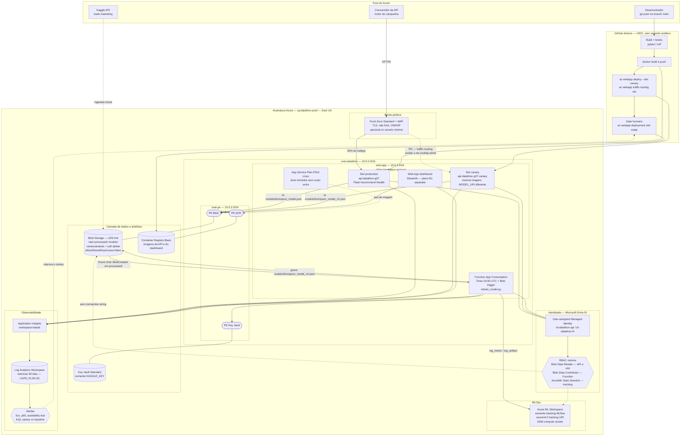

# Arquitetura Azure — Datathon FIAP G37

> **Escopo deste documento.** Desenho de arquitetura-alvo em Azure para o serviço de recomendação
> de campanha (Thompson Sampling contextual), escrito como se fosse implantado por uma empresa.
> Aprofunda a seção "Azure" de [`docs/ARQUITETURA.md`](../ARQUITETURA.md), que permanece como a
> visão comparativa AWS × Azure de alto nível.
>
> **Regra editorial deste arquivo:** toda estimativa de custo abaixo tem fonte primária citada
> (Azure Retail Prices API ou página oficial), com data de consulta. Onde não foi possível
> confirmar um preço, isso está declarado explicitamente — não há número inventado.
> Todos os preços foram consultados em **04/08/2026**, região **East US**, moeda **USD**,
> preço de tabela pay-as-you-go (sem descontos de EA, reserva ou savings plan).

---

## 1. Visão geral

O sistema é um serviço de decisão *stateless* e deliberadamente pequeno: o dataset de referência
(Kaggle bank-marketing) tem ~41.188 linhas e ocupa 171 KB como parquet em `data/processed/`; o
artefato de modelo (`data/models/thompson_model.json`) é um JSON de ~4,8 KB com os posteriores Beta
de 12 contextos × 4 braços; e `scripts/retrain_model.py` treina o modelo completo em segundos, em
CPU, com um laço `for` sobre um DataFrame pandas — sem GPU, sem paralelismo, sem estágio de
*feature engineering* pesado. A arquitetura-alvo reflete essa realidade: **PaaS e serverless
gerenciados, sem plano de compute de treino dedicado**. Azure App Service serve a API Flask
(`src/datathon/api/app.py`) com *deployment slots* fazendo o canary deploy em nível de
infraestrutura; Azure Functions em plano Consumption executa o retreino agendado; Blob Storage
guarda dados e artefatos versionados; um Azure ML Workspace é usado **exclusivamente como
tracking server MLflow gerenciado** (o workspace em si não é cobrado), substituindo o SQLite local
em `.mlflow/mlflow.db`; e Application Insights concentra telemetria, incluindo a comparação
estatística entre baseline e canary que hoje vive em um dicionário na memória do processo Flask.
Toda autenticação entre serviços usa Managed Identity com RBAC de menor privilégio — nenhuma
connection string.

---

## 2. Diagrama de arquitetura



**Leitura do diagrama em uma frase:** o tráfego entra pela borda, é dividido por peso entre os
slots *production* e *canary* do mesmo App Service Plan; ambos os slots leem o artefato de modelo
do Blob via Private Endpoint autenticando com Managed Identity; uma Function agendada regrava o
artefato versionado e registra o experimento no Azure ML; e toda a telemetria dos dois slots cai no
mesmo Application Insights, que é quem decide se o canary é promovido.

---

## 3. Seleção de serviços e por quê

| Necessidade | Serviço Azure | Papel | Por que este serviço e não uma alternativa mais pesada |
|---|---|---|---|
| Hospedar a API Flask | **App Service (Linux, Web App for Containers)** | Serve `/recommend`, `/health`, `/apidocs`; slots de deploy | O diferencial decisivo é o **traffic routing nativo entre slots** (§4) — é a única opção PaaS da Azure que entrega canary por peso sem escrever nenhuma linha de infraestrutura. AKS entregaria o mesmo com Ingress/Service Mesh, mas exige operar um cluster Kubernetes para servir um JSON de 4,8 KB. Container Apps também faz split por *revision*, mas o projeto já tem App Service provisionado (`.azure/config`) e o modelo de slot + swap é mais simples de auditar. |
| Executar o retreino | **Azure Functions — plano Consumption** | Timer Trigger diário + Event Grid `BlobCreated`; roda a lógica de `scripts/retrain_model.py` | **Azure ML Compute Cluster é desproporcional aqui** e essa decisão é deliberada: o treino é um laço pandas sobre 41 mil linhas que termina em segundos. Um cluster gerenciado adicionaria tempo de provisionamento de VM (minutos), custo de nó ocioso e uma superfície de configuração inteira para uma carga que cabe folgadamente na *free grant* de 400.000 GB-s do Consumption. Se o dataset crescer duas ordens de grandeza ou o modelo passar a exigir GPU, essa decisão deve ser revista — o gatilho está registrado em §9. |
| Dados, artefatos e versões de modelo | **Blob Storage (Hot, LRS)** | Containers `raw/`, `processed/`, `models/`; versionamento de blob + soft delete | Volume real: 18 MB de CSVs Kaggle, 1,8 MB de parquet processado, 16 KB de modelos. Azure Data Lake Storage Gen2 (namespace hierárquico) cobra operações mais caras e só se paga em cargas analíticas com particionamento pesado. Um banco (SQL/Cosmos) seria errado: o artefato é um arquivo imutável e versionado, não um registro consultável. |
| Tracking de experimentos | **Azure ML Workspace (somente tracking)** | Endpoint MLflow-compatível nativo; substitui `sqlite:///.mlflow/mlflow.db` | O projeto já declara `azureml-mlflow` e `azure-ai-ml` em `requirements.txt`, então a migração é trocar a URI em `ModelTrainer.setup_mlflow()`. O workspace **não tem cobrança própria** (§8) e usar só o tracking evita provisionar qualquer compute. Alternativa mais pesada seria hospedar um MLflow Server em container + Postgres gerenciado — mais um serviço de banco, mais um app para operar, pelo mesmo resultado. |
| Registro de imagens | **Container Registry Basic** | Imagens da API e do dashboard, consumidas pelo App Service | Standard e Premium só se justificam por throughput de webhook, geo-replicação e escopos de token. Nada disso se aplica a duas imagens pequenas com deploy diário. |
| Dashboard Streamlit | **App Service (plano B1 Linux separado)** | `app_dashboard_pt.py` / `app_canary_arm_swap_demo.py` | Plano separado do da API por isolamento de blast radius: um dashboard travado (Streamlit é *stateful* e single-process) não pode consumir a CPU do plano que serve produção. B1 basta porque o dashboard é interno e de baixo tráfego. |
| Identidade entre serviços | **User-assigned Managed Identity + RBAC** | Autenticação App Service → Blob / Key Vault / Azure ML | "Managed identities can be used at no extra cost" ([docs Entra](https://learn.microsoft.com/en-us/entra/identity/managed-identities-azure-resources/overview), consultado em 04/08/2026). *User-assigned* é a recomendação explícita da Microsoft para serviços — e é obrigatória aqui, porque identidade **não é swapada entre slots** (§4, §5). |
| Segredos | **Key Vault Standard** | Guarda o `KAGGLE_KEY` (o único segredo real do projeto, ver `.env.example`) | Não há credencial de banco, nem chave de API de terceiros, nem certificado próprio. Key Vault Premium (HSM) resolveria um requisito de custódia de chave criptográfica que este projeto não tem. |
| Observabilidade | **Application Insights (workspace-based) + Log Analytics** | Telemetria, tracing, métricas de canary, alertas | Application Insights *workspace-based* é o que permite consultar telemetria da API e logs de plataforma na mesma linguagem (KQL) — e é justamente o que substitui o `CANARY_CONFIG['metrics']` em memória por uma fonte de verdade compartilhada entre instâncias (§4). |
| Fronteira de rede | **VNet + Private Endpoints + Front Door/WAF** | Blob, Key Vault e ACR sem exposição pública | Descrito como alvo de produção (cenário B). No cenário acadêmico/demo isso é omitido conscientemente — ver §8 e §9. |

---

## 4. Canary deploy no Azure

Esta é a seção mais importante do documento, porque o projeto **já implementou canary deploy em
código** e a pergunta certa não é "como fazer canary na Azure", e sim "o que exatamente da
implementação atual sobrevive à ida para a nuvem, e o que precisa mudar de camada".

### 4.1 O que existe hoje no código

Em `src/datathon/api/app.py`:

- `CANARY_CONFIG` (linha 50) é um dicionário de módulo com `canary_percentage`, os nomes dos dois
  modelos e um acumulador de métricas.
- `/canary/start` carrega um **segundo modelo em memória** (`CANARY_MODEL`, via
  `load_model_from_path`, linha 391) — o baseline (`MODEL`) continua carregado no mesmo processo.
- `/canary/recommend` decide o braço com `if random.random() < (CANARY_CONFIG['canary_percentage'] / 100)`
  (linha 451) e contabiliza o resultado em `CANARY_CONFIG['metrics']['baseline'|'canary']`.
- `/canary/metrics` roda o teste qui-quadrado via `datathon.validation.compare_conversions` e
  devolve `should_promote = is_significant and improvement > 0.001` (linha 584).
- `/canary/promote` e `/canary/rollback` apenas fazem `CANARY_CONFIG['enabled'] = False` e zeram
  os contadores.

Esse desenho é **excelente como demonstração pedagógica** — é o que permite o roteiro de vídeo do
[`CANARY_DEMO_GUIDE.md`](../../CANARY_DEMO_GUIDE.md), inclusive o caso `Young_Technical`, em que o
retreino com o dataset completo inverte a oferta vencedora de `Email_Campaign` para
`Cellular_Standard`. Mas ele tem cinco
limitações estruturais que só aparecem quando existe mais de uma instância servindo tráfego:

| # | Limitação da implementação em processo | Consequência em produção |
|---|---|---|
| 1 | `CANARY_CONFIG` é estado **local ao processo** | Com 2+ instâncias no App Service, cada worker tem seu próprio dicionário. `/canary/metrics` devolve o que a instância sorteada pelo balanceador tiver visto — os números não somam, e o p-valor é calculado sobre uma amostra parcial. |
| 2 | `random.random()` decide **por requisição**, sem afinidade | O mesmo cliente pode cair no baseline em uma chamada e no canary na seguinte. Para um bandit isso não quebra a decisão (ela já é estocástica), mas destrói a atribuição por sessão e infla a variância da comparação A/B. |
| 3 | Baseline e canary compartilham o **mesmo processo** | Um modelo candidato corrompido, um `KeyError` em `select_arm` ou um estouro de memória derruba os dois. Isso anula a premissa central do canary, que é conter o raio de dano. |
| 4 | `/canary/promote` **não promove artefato nenhum** | Ele desliga a flag. O arquivo `thompson_model.json` continua o mesmo. A promoção real (trocar qual JSON é produção) não é feita, nem registrada, nem auditável. |
| 5 | `/canary/recommend` chama `model.update(context, arm_id, converted)` (linha 472) com uma conversão **simulada** | Correto e necessário para a demo (sem isso o dashboard fica zerado), mas em produção significa que o posterior do modelo aprende com recompensa falsa — e cada instância aprende uma coisa diferente. |

### 4.2 O mecanismo nativo da Azure

Azure App Service oferece **deployment slots com roteamento de tráfego por peso**, que é canary
deploy em nível de infraestrutura, e não custa nada além do plano:

> "There's no extra charge for using deployment slots. Each App Service plan tier supports a
> different number of deployment slots."
> — [Set up staging environments in Azure App Service](https://learn.microsoft.com/en-us/azure/app-service/deploy-staging-slots), consultado em 04/08/2026

O split percentual é uma configuração, não código:

```bash
# roteia 5% do tráfego de produção para o slot canary
az webapp traffic-routing set \
  --resource-group rg-datathon-prod \
  --name api-datathon-g37 \
  --distribution canary=5
```

E o comportamento documentado do roteamento resolve diretamente a limitação #2 acima:

> "After a client is automatically routed to a specific slot, it's *pinned* to that slot for one
> hour or until the cookies are deleted. [...] A request that's routed to the staging slot has the
> cookie `x-ms-routing-name=staging`. A request that's routed to the production slot has the cookie
> `x-ms-routing-name=self`."
> — mesma fonte

Ou seja: a plataforma dá **afinidade de sessão de 1 hora de graça**, que é exatamente o que o
`random.random()` por requisição não consegue oferecer. Além disso, com o peso em 0% o slot
continua acessível por opt-in explícito via `?x-ms-routing-name=canary` — o que permite QA e
validação interna do candidato sem expor nenhum cliente real.

### 4.3 Mapeamento concreto: em processo → infraestrutura

| Conceito no código | Equivalente Azure | Ganho |
|---|---|---|
| `MODEL` (baseline em memória) | Slot **production**, app setting `MODEL_URI=.../models/thompson_model.json` | — |
| `CANARY_MODEL` (candidato em memória) | Slot **canary**, mesma imagem de container, `MODEL_URI=.../models/thompson_model_v20260804_031500.json` | Processo, memória e sistema de arquivos separados: o candidato não pode derrubar o baseline (resolve #3) |
| `CANARY_CONFIG['canary_percentage']` + `random.random()` | `az webapp traffic-routing set --distribution canary=5` | Split no *front end* do App Service, consistente entre todas as instâncias, com pinning de 1 h (resolve #2) |
| `CANARY_CONFIG['metrics']` (dict de módulo) | Application Insights: telemetria dos dois slots no mesmo workspace, separada por `cloud_RoleName` | Fonte de verdade única e centralizada, independente do número de instâncias (resolve #1) |
| `compare_conversions()` em `/canary/metrics` | Consulta KQL agendada (scheduled query alert) sobre o Log Analytics, usando a mesma lógica estatística | Roda fora do caminho de request; não depende de nenhum processo estar vivo |
| `/canary/promote` | `az webapp deployment slot swap --slot canary --target-slot production` | Swap real, com *warm-up* garantido e zero downtime; o artefato promovido é o que estava rodando (resolve #4) |
| `/canary/rollback` | **O mesmo comando de swap, executado de novo** | Após o swap, o slot canary contém a versão anterior de produção. A documentação chama isso de recuperar o *last known good site*: "restore the slots to their pre-swap states by swapping the same two slots immediately." |
| `model.update(..., converted)` com conversão simulada | Removido do caminho de produção; a recompensa real vem do sistema de campanha, ingerida em batch pelo retreino | Elimina aprendizado sobre recompensa sintética (resolve #5) |

Consulta KQL que substitui o `/canary/metrics` (conceitual):

```kusto
customEvents
| where name == "RecommendationServed"
| where timestamp > ago(24h)
| extend slot = tostring(customDimensions.cloud_RoleName)
| extend converted = toint(customDimensions.converted)
| summarize total = count(), conversions = sum(converted) by slot
| extend rate = todouble(conversions) / total
```

### 4.4 Substitui ou complementa?

**Substitui** no caminho de produção. O roteamento por `random.random()` dentro do processo não
deve existir em produção, pelas cinco razões da tabela §4.1.

**Complementa** em dois pontos, e isso é intencional:

1. **Modo demo permanece.** Os endpoints `/canary/*` continuam válidos para rodar a demonstração
   localmente, sem conta Azure — é o que sustenta o roteiro de vídeo e a reprodutibilidade da
   entrega acadêmica. Eles devem ser desabilitados por *feature flag* (`ENABLE_INPROCESS_CANARY`)
   quando a variável de ambiente indicar produção.
2. **Split por modelo sem redeploy.** Slots trocam *código + configuração*. Se no futuro o time
   quiser comparar dois artefatos de modelo **sem** publicar uma nova imagem, um split em processo
   controlado por uma flag remota (App Configuration) continua sendo a ferramenta certa — mas como
   experimento de modelo, não como mecanismo de deploy.

### 4.5 Armadilhas reais desse desenho (verificadas na documentação oficial)

Quatro pegadinhas que fariam um canary real falhar em produção e que precisam estar no runbook:

1. **A SKU atual do projeto não suporta slots.** O arquivo `.azure/config` versionado no repositório
   declara `sku = F1` e `appserviceplan = plan-datathon-free`. Deployment slots exigem tier
   **Standard, Premium ou Isolated** — "For you to enable multiple deployment slots, the app must be
   running in the Standard, Premium, or Isolated tier." A tabela de limites confirma: Free, Shared e
   Basic não têm nenhum slot; Standard tem 5; Premium e Isolated têm 20
   ([App Service limits](https://learn.microsoft.com/en-us/azure/azure-resource-manager/management/azure-subscription-service-limits), consultado em 04/08/2026).
   Consequência de custo tratada em §8.
2. **`MODEL_URI` precisa ser marcado como *slot setting*.** App settings são swapados por padrão.
   Se `MODEL_URI` não for fixado ao slot, o swap leva a URI do modelo candidato para produção — e
   depois o slot canary passa a apontar para o modelo antigo. Correção:
   `az webapp config appsettings set ... --slot canary --settings MODEL_URI=<uri> --slot-settings MODEL_URI`.
3. **Managed identity NÃO é swapada, e cada slot tem a sua.** A documentação lista "Managed
   identities" entre as configurações que **não** são swapadas, e especifica: "For a deployment
   slot, the name of its system-assigned managed identity is `<app-name>/slots/<slot-name>`". Se a
   identidade do slot canary não receber sua própria atribuição de `Storage Blob Data Reader` no
   container `models`, o canary sobe e falha em carregar o modelo. Usar uma **user-assigned**
   identity atribuída aos dois slots elimina esse problema pela raiz.
4. **O `/health` atual passaria no warm-up mesmo com o modelo quebrado.** Em `app.py` (linhas
   216-220), `/health` devolve HTTP 200 com `"model": "not_loaded"` quando o arquivo do modelo não
   existe ou falha ao carregar — `load_model()` só emite um `logger.warning` (linha 97). Combinado
   com `WEBSITE_SWAP_WARMUP_PING_PATH=/health`, isso significa que um canary sem modelo seria
   considerado "aquecido com sucesso" e promovido a produção. **Antes de habilitar o swap, `/health`
   precisa devolver 503 quando `MODEL is None`.** É uma mudança de uma linha com impacto direto na
   segurança do deploy.

---

## 5. Segurança e governança

### 5.1 Identidade: Managed Identity, nunca connection string

O código atual, em `src/datathon/config.py` (linha 142), monta o `storage_config` do ambiente
AZURE com `'connection_string': os.getenv('AZURE_STORAGE_CONNECTION_STRING')`. Uma connection
string de Storage contém a **chave da conta**, que dá acesso total a todos os containers, não
expira e não é rastreável por identidade. Ela é exatamente o antipadrão que este desenho proíbe.

Refatoração alvo — o cliente de Blob passa a resolver credencial pela cadeia do `azure-identity`
(que já é dependência do projeto), que dentro do App Service resolve para a Managed Identity
automaticamente:

```python
from azure.identity import DefaultAzureCredential
from azure.storage.blob import BlobServiceClient

client = BlobServiceClient(
    account_url=f"https://{account}.blob.core.windows.net",
    credential=DefaultAzureCredential(),   # Managed Identity no App Service / Functions
)
```

Complementarmente, a conta de Storage deve ter `allowSharedKeyAccess = false`, o que torna a chave
inutilizável mesmo se vazar.

### 5.2 RBAC de menor privilégio

Uma identidade por carga de trabalho, com o menor papel que resolve o caso de uso:

| Identidade | Escopo | Papel | Justificativa |
|---|---|---|---|
| `id-datathon-api` (slots production e canary) | container `models` | **Storage Blob Data Reader** | A API só lê o artefato. Não deve poder sobrescrever um modelo. |
| `id-datathon-api` | container `processed` | *nenhum* | A API não lê dados brutos. |
| `id-datathon-fn` (Function de retreino) | container `processed` | **Storage Blob Data Reader** | Lê o parquet de treino. |
| `id-datathon-fn` | container `models` | **Storage Blob Data Contributor** | Escreve `thompson_model_vX.json`. |
| `id-datathon-fn` | Azure ML Workspace | **AzureML Data Scientist** ou papel custom | Para MLflow tracking a documentação exige apenas `workspaces/experiments/*` e `workspaces/jobs/*` — um papel custom com essas duas ações é o mínimo estrito. |
| `id-datathon-fn` | Key Vault | **Key Vault Secrets User** | Lê o `KAGGLE_KEY` na ingestão. Não pode criar nem listar segredos. |
| GitHub Actions (federated credential OIDC) | resource group | **Website Contributor** + **AcrPush** | Publica imagem e faz deploy/swap. Não é Owner, não gerencia RBAC. |

Nenhum *service principal* com segredo de cliente é criado: o CI/CD usa **OIDC federated
credentials**, e as cargas em runtime usam Managed Identity. Não existe segredo estático de Azure
no repositório nem nos secrets do GitHub.

### 5.3 Superfície de rede

- Blob, Key Vault e ACR acessíveis **apenas por Private Endpoint** (`snet-pe`), com acesso público
  desabilitado; App Service e Function usam VNet Integration regional para alcançá-los.
- Storage: acesso público a blob desligado, TLS mínimo 1.2, HTTPS obrigatório, versionamento de
  blob e *soft delete* habilitados (dá rollback de artefato independente do rollback de deploy).
- App Service: HTTPS Only, TLS 1.2+, e — se houver Front Door — *access restriction* aceitando
  somente o `X-Azure-FDID` correto, para que ninguém contorne o WAF batendo direto em
  `*.azurewebsites.net`.
- O slot canary tem seu próprio hostname público (`api-datathon-g37-canary.azurewebsites.net`).
  Em produção ele deve ficar atrás de access restriction, senão vira uma porta de entrada sem WAF.
  Note que *IP restrictions* também **não são swapadas**, então cada slot precisa da sua regra.

### 5.4 Governança de dados

A postura de proteção de dados não é redefinida aqui — ela está em
[`docs/LGPD_PLAN.md`](../LGPD_PLAN.md) e este desenho apenas a implementa em serviços concretos:

- **Retenção de 90 dias do decision log** (LGPD_PLAN §5) → configurada no Log Analytics Workspace,
  com custo modelado em §8.
- **Campos permitidos e proibidos no log** (LGPD_PLAN §6) → aplicados como *telemetry initializer*
  do Application Insights, que descarta dimensões fora do contrato antes da ingestão. Isso importa
  duplamente na Azure: campo que não é ingerido não é armazenado **e** não é cobrado.
- **Revisão humana em mudança de política** (LGPD_PLAN §7) → materializada como *protection rule*
  do GitHub Environments no passo de swap (§7), com aprovador nomeado e registro imutável.
- **Ausência de PII** → o artefato promovido continua sendo agregados estatísticos por contexto,
  então não há dado pessoal em trânsito entre slots nem no Blob.

---

## 6. Observabilidade

### 6.1 Instrumentação

Application Insights *workspace-based* (telemetria vai para o Log Analytics, o que permite
correlacionar logs de aplicação com logs de plataforma na mesma consulta KQL). A instrumentação da
API Flask é feita via OpenTelemetry / Azure Monitor distro, com dois tipos de sinal:

- **Automático:** requisições, latência por percentil, taxa de erro, dependências (chamadas ao
  Blob), exceções com stack trace, *live metrics*.
- **Custom event `RecommendationServed`** por decisão, com as dimensões que o
  [`LGPD_PLAN.md`](../LGPD_PLAN.md) §6 já especifica como o contrato do decision log:
  `decision_id`, `age_group`, `job_category`, `recommended_arm`, `expected_conversion`,
  `model_version` — e nada além disso.

O campo `model_version` é o que amarra a telemetria à versão do artefato (`thompson_model_vX.json`),
e o `cloud_RoleName` distingue slot production de slot canary automaticamente.

### 6.2 Alertas

| Alerta | Condição | Severidade | Ação |
|---|---|---|---|
| Modelo não carregado | `/health` retornando `model != loaded` (após a correção de §4.5.4) | Crítica | Bloqueia swap; página o on-call |
| Taxa de 5xx | > 1% em 5 min | Crítica | Rollback automático do canary (`traffic-routing clear`) |
| Latência p95 | > 300 ms em 15 min | Alta | Investigar; não promove |
| Disponibilidade | Standard Web Test em `/health` falhando em 2 de 3 localidades | Crítica | Página o on-call |
| Canary pior que baseline | KQL: `canary_rate < baseline_rate` com significância, sobre janela de 24 h | Alta | Reprova a promoção no pipeline |
| Drift de conversão | Taxa observada por contexto desviando da esperada do artefato ativo | Média | Agenda retreino fora do ciclo |
| Falha do retreino | Function com exceção ou sem execução no timer | Média | Notifica; produção segue no artefato atual (fail-safe) |

O alerta de "canary pior que baseline" é a versão operacional do `should_promote` que hoje vive em
`/canary/metrics` (`app.py` linha 584): mesma lógica estatística (`compare_conversions`, qui-quadrado,
p < 0,05), mas avaliada centralmente sobre todas as instâncias em vez de sobre o dicionário de um
processo.

---

## 7. CI/CD e automação do retreino

O ciclo de vida completo, do commit ao artefato em produção — amarrando o fluxo de canary que já
existe na API com os deployment slots de §4.

### 7.1 Pipeline de código

```
git push main
  └─> GitHub Actions
      ├─ pytest + ruff
      ├─ docker build
      ├─ az acr login (OIDC) + docker push  → ACR Basic
      └─ az webapp deploy --slot canary      → slot canary, 0% de tráfego
```

Publicar no slot canary com 0% de tráfego é seguro por construção: o slot fica acessível apenas por
opt-in (`?x-ms-routing-name=canary`), o que permite rodar o smoke test contra o candidato real sem
que nenhum cliente de produção seja afetado.

### 7.2 Pipeline de modelo (retreino)

```
Timer Trigger 03:00 UTC (diário)   ou   Event Grid: BlobCreated em processed/
  └─> Function App (Consumption)
      ├─ lê processed/bank_marketing_primary.parquet  (Managed Identity)
      ├─ treina ContextualThompsonSampling            (segundos, CPU)
      ├─ grava models/thompson_model_v{timestamp}.json (Blob, versionado)
      └─ mlflow.log_param/log_metric/log_artifact     → Azure ML tracking URI
```

A única mudança real em `scripts/retrain_model.py` é o `setup_mlflow()`: onde hoje há
`mlflow.set_tracking_uri(f"sqlite:///{db_path}")`, passa a haver a URI `azureml://` do workspace,
obtida com `az ml workspace show --query mlflow_tracking_uri`
([Configure MLflow for Azure Machine Learning](https://learn.microsoft.com/en-us/azure/machine-learning/how-to-use-mlflow-configure-tracking), consultado em 04/08/2026).
O resto da classe `ModelVersionManager` — sufixo de versão por timestamp, `save_versioned_model`,
`save_production_model` — mapeia 1:1 para blobs em `models/`.

### 7.3 Portão de materialidade

Depois do retreino, o pipeline roda `scripts/compare_models.py` entre o artefato de produção e o
candidato. Esse script já detecta e marca com `[ARM!]` os contextos em que o **braço vencedor muda**
— é exatamente o caso `Young_Technical` documentado no
[`CANARY_DEMO_GUIDE.md`](../../CANARY_DEMO_GUIDE.md), em que o retreino com o dataset completo inverte
a oferta de `Email_Campaign` (11,67%) para `Cellular_Standard` (22,51%).

Esse teste vira o **gatilho de decisão** do pipeline:

- **Nenhuma troca de braço + variação de taxa < 0,5 pp** → mudança imaterial. Deploy direto no slot
  canary com swap imediato após smoke test.
- **Alguma troca de braço** (`[ARM!]`) → mudança **material**: clientes reais passariam a receber
  outra oferta. Canary com tráfego percentual é **obrigatório**, com janela de soak mínima.

Esse é o argumento de negócio do canary neste projeto específico: `compare_models.py` acusa `[ARM!]`
tanto para trocas de braço genuínas quanto para trocas que são só ruído de amostragem do posterior
Beta — e a comparação offline, por si só, não distingue as duas coisas. No caso `Young_Technical`, o
ganho de +10,84 pp (11,67% → 22,51%) reflete uma tendência real do dataset (a conversão global
praticamente dobra entre a primeira e a segunda metade do período de campanha), não sorte do
amostrador — mas isso só pôde ser confirmado observando tráfego real, não pela leitura do artefato
candidato isolado. Promover às cegas qualquer troca de braço, grande ou pequena, é apostar a receita
de um segmento inteiro sem medir. O canary existe para transformar essa aposta em uma medição.

### 7.4 Promoção — a jornada completa de um `thompson_model_vX.json`

```
1. Function grava models/thompson_model_v20260804_031500.json
2. compare_models.py acusa [ARM!] em Young_Technical → mudança material
3. Deploy no slot canary com MODEL_URI apontando para o novo artefato
   az webapp config appsettings set --slot canary \
     --settings MODEL_URI=".../thompson_model_v20260804_031500.json" \
     --slot-settings MODEL_URI            # <- não pode ser swapado (§4.5.2)
4. Smoke test via ?x-ms-routing-name=canary (0% de tráfego real)
5. az webapp traffic-routing set --distribution canary=5
6. Soak: 24 h ou N decisões mínimas, o que vier depois
7. Portão automático (KQL + compare_conversions):
     p < 0,05  AND  improvement > 0,1 pp  AND  5xx e p95 sem regressão
8. Portão humano: GitHub Environments protection rule
   (materializa "revisão humana" — LGPD_PLAN §7)
9. az webapp deployment slot swap --slot canary --target-slot production
   (opcionalmente --action preview para validar antes de completar)
10. az webapp traffic-routing clear
11. Copiar o artefato promovido para models/thompson_model.json
    (ponteiro estável; a versão anterior permanece no versionamento do Blob)
```

**Rollback**, em qualquer ponto:

- Antes do swap: `az webapp traffic-routing clear` → 100% volta para production instantaneamente.
- Depois do swap: `az webapp deployment slot swap` de novo → o slot canary contém a versão anterior
  de produção, e o swap a restaura sem downtime.
- Do artefato: soft delete + versionamento do Blob permitem restaurar qualquer
  `thompson_model_vX.json` anterior sem redeploy.

Comparado ao `/canary/promote` atual (que apenas faz `enabled = False`), esse fluxo entrega o que
o endpoint *pretende* significar: a promoção é atômica, registrada no Activity Log
(`Microsoft.Web/sites/slots/slotsswap/action`), reversível por um comando, e o artefato promovido é
literalmente o mesmo que foi validado com tráfego real.

---

## 8. Estimativa de custos

### 8.1 Metodologia e fontes

Todos os preços unitários abaixo vieram da **Azure Retail Prices API** — a API pública e oficial de
preços de tabela da Microsoft — consultada em **04/08/2026**:

- Endpoint: `https://prices.azure.com/api/retail/prices`
- Documentação: <https://learn.microsoft.com/en-us/rest/api/cost-management/retail-prices/azure-retail-prices>
- Filtros usados: `armRegionName eq 'eastus'`, `currencyCode='USD'`, `priceType eq 'Consumption'`

Motivo de usar a API em vez das páginas de pricing: as páginas
(`azure.microsoft.com/pricing/details/...`) renderizam os valores por JavaScript e retornam `$-`
quando lidas programaticamente — a API devolve o mesmo preço de tabela em forma verificável e
reproduzível.

**Convenção:** mês = 730 horas. Todos os valores são preço de tabela pay-as-you-go, sem descontos
de Enterprise Agreement, reserva de capacidade ou savings plan, e **sem impostos**.

**Preços unitários confirmados (East US, USD, 04/08/2026):**

| Recurso | SKU / medidor | Preço unitário | Fonte |
|---|---|---|---|
| App Service Plan Linux | F1 (Free) | **$0,0000**/h | Retail Prices API, `Azure App Service Free Plan - Linux` |
| App Service Plan Linux | B1 (Basic) | **$0,0170**/h → $12,41/mês | Retail Prices API, `Azure App Service Basic Plan - Linux` |
| App Service Plan Linux | S1 (Standard) | **$0,0950**/h → $69,35/mês | Retail Prices API, `Azure App Service Standard Plan - Linux` |
| App Service Plan Linux | **P0v3 (Premium v3)** | **$0,0775**/h → $56,58/mês | Retail Prices API, `Azure App Service Premium v3 Plan - Linux` |
| Blob Storage | Hot LRS — Data Stored | **$0,0208** por GB/mês | Retail Prices API, `General Block Blob v2` |
| Blob Storage | Hot LRS — Write Operations | **$0,05** por 10 mil | idem |
| Blob Storage | Hot — Read Operations | **$0,004** por 10 mil | idem |
| Azure Functions Consumption | Execuções | **grátis até 1.000.000/mês**, depois $0,20 por milhão | Retail Prices API, `Functions / Standard Total Executions` (tier grátis até `tierMinimumUnits=100000` × 10) |
| Azure Functions Consumption | Tempo de execução | **grátis até 400.000 GB-s/mês**, depois $0,000016/GB-s | Retail Prices API, `Functions / Standard Execution Time` (`tierMinimumUnits=400000`) |
| Log Analytics / App Insights | Analytics Logs — Data Ingestion | **primeiros 5 GB/mês grátis**, depois **$2,30**/GB | Retail Prices API, `Log Analytics / Analytics Logs` (`tierMinimumUnits=5.0`) |
| Log Analytics | Data Retention (além dos 31 dias inclusos) | **$0,10** por GB/mês | idem |
| Azure Monitor | Alerta de métrica | **10 primeiros grátis**, depois $0,10/mês cada | Retail Prices API, `Azure Monitor / Alerts Metric Monitored` |
| Azure Monitor | Alerta de log a cada 5 min | **$1,50**/mês por regra | Retail Prices API, `Alerts System Log Monitored at 5 Minute Frequency` |
| Azure Monitor | Standard Web Test | **$0,0005** por execução | Retail Prices API, `Azure Monitor / Standard Web Test` |
| Container Registry | Basic — Registry Unit | **$0,1666**/dia → $5,07/mês | Retail Prices API, `Container Registry / Basic` |
| Key Vault | Standard — Operations | **$0,03** por 10 mil operações | Retail Prices API, `Key Vault / Standard` |
| Bandwidth | Data Transfer Out (internet) | **primeiros 100 GB/mês grátis**, depois $0,08/GB | Retail Prices API, `Bandwidth - Routing Preference: Internet` |
| **Azure ML Workspace** | — | **sem cobrança pelo workspace** | Página oficial: *"there is no additional charge to use Azure Machine Learning. However, along with compute, you will incur separate charges for other Azure services consumed, including but not limited to Azure Blob Storage, Azure Key Vault, Azure Container Registry and Azure Application Insights"* — <https://azure.microsoft.com/en-us/pricing/details/machine-learning/>, consultado em 04/08/2026 |
| **Managed Identity + RBAC** | — | **sem custo** | *"Managed identities can be used at no extra cost"* — <https://learn.microsoft.com/en-us/entra/identity/managed-identities-azure-resources/overview>, consultado em 04/08/2026 |
| **Deployment slots** | — | **sem custo adicional** | *"There's no extra charge for using deployment slots"* — <https://learn.microsoft.com/en-us/azure/app-service/deploy-staging-slots>, consultado em 04/08/2026 |

> **Preço que NÃO foi possível confirmar.** Não consegui obter o preço de **Private Endpoint /
> Azure Private Link** pela Retail Prices API (as consultas por `serviceName eq 'Private Link'`,
> `'Azure Private Link'` e por `serviceFamily eq 'Networking'` retornaram vazio para esse medidor).
> Por isso os Private Endpoints do cenário B estão listados com custo **não confirmado** e **não
> somados** ao total. A referência para verificação manual é
> <https://azure.microsoft.com/en-us/pricing/details/private-link/>. Pela mesma razão, Front Door /
> WAF e DDoS Protection também não estão precificados aqui.

### 8.2 Cenário A — mínimo acadêmico / demo

**Premissas de tráfego (declaradas, não medidas):**

- 1.000 chamadas/dia a `/recommend` (≈30.400/mês) — volume de demonstração, gravação de vídeo e
  testes de avaliação, não de operação real.
- Telemetria: ~2 KB por chamada → ~0,06 GB/mês.
- Retreino **semanal** (4 execuções/mês), ~60 s a 0,5 GB de memória → ~120 GB-s/mês.
- Dados em Blob: 18 MB (Kaggle raw) + 1,8 MB (parquet processado) + 16 KB (modelos) ≈ **0,1 GB**.
- API e dashboard no **mesmo plano F1 Free**.
- Sem VNet, sem Private Endpoints, sem WAF, sem alta disponibilidade.

| Item | Cálculo | USD/mês |
|---|---|---|
| App Service Plan F1 Linux (API + dashboard) | $0,0000/h × 730 | **0,00** |
| Blob Storage — dados armazenados | 0,1 GB × $0,0208 | 0,00 |
| Blob Storage — operações | << 10 mil ops | ~0,00 |
| Azure Functions — execuções | 4 (franquia: 1.000.000) | **0,00** |
| Azure Functions — tempo de execução | 120 GB-s (franquia: 400.000) | **0,00** |
| Application Insights / Log Analytics — ingestão | 0,06 GB (franquia: 5 GB) | **0,00** |
| Storage account do Function App + do Azure ML | ~1 GB × $0,0208 | 0,02 |
| Key Vault Standard | < 10 mil ops × $0,03/10 mil | 0,03 |
| Azure ML Workspace (tracking MLflow) | sem cobrança pelo workspace | 0,00 |
| Egress | < 1 GB (franquia: 100 GB) | 0,00 |
| **Total cenário A** | | **≈ $0,05/mês** |

**Conclusão: o cenário acadêmico cabe essencialmente no free tier.** O que se paga é o
arredondamento de storage e operações de Key Vault — na prática, centavos.

**Ressalvas honestas do F1**, que são o preço real dessa gratuidade:

- **60 minutos de CPU por dia** e 1 GB de RAM (fonte: <https://azure.microsoft.com/en-us/pricing/details/app-service/linux/>,
  consultado em 04/08/2026). Ao estourar a cota, o app é parado até o dia seguinte.
- Sem *Always On*: após ~20 min de ociosidade a instância é descarregada, e a primeira requisição
  seguinte paga o *cold start* mais o `load_model()` do startup.
- **Sem deployment slots** (§4.5.1) — ou seja, **o cenário A não consegue fazer o canary de
  infraestrutura**. A demonstração de canary continua sendo a implementação em processo
  (`/canary/*`), que é justamente para o que ela foi feita.
- Sem SLA.

### 8.3 Cenário A+ — demo com canary de infraestrutura real

Se o objetivo for demonstrar canary **em nível de infraestrutura** (slots + traffic routing), o
plano precisa subir para Standard ou superior. Aqui aparece um achado que vale registrar:

| Opção | Preço/h | Preço/mês | Slots por app |
|---|---|---|---|
| S1 Linux (Standard) | $0,0950 | $69,35 | 5 |
| **P0v3 Linux (Premium v3)** | **$0,0775** | **$56,58** | **20** |

**P0v3 é ~18% mais barato que S1 e oferece 4× mais slots.** Para este caso de uso, escolher
Standard porque "Standard é o tier mínimo que tem slots" seria pagar mais por menos — o mínimo que
*habilita* slots não é o mais barato que os habilita.

- **Canary permanente (P0v3 rodando o mês inteiro):** ≈ **$56,63/mês** (plano + os $0,05 do cenário A).
- **Canary sob demanda:** como o plano é cobrado por hora, dá para subir de F1 para P0v3 apenas
  durante a janela de validação e voltar depois. Uma janela de 8 h custa
  8 × $0,0775 = **$0,62**. Para uma entrega acadêmica que precisa demonstrar o mecanismo real uma
  vez, essa é a opção correta.

### 8.4 Cenário B — produção de uma fintech pequena

**Premissas de tráfego (declaradas, não medidas — são a base de toda a conta abaixo):**

- **100.000 chamadas/dia** a `/recommend` ≈ **3,04 milhões/mês**. Média de ~1,2 req/s, com pico
  estimado em 10× a média (~12 req/s). Perfil compatível com uma fintech decidindo oferta de
  campanha para uma base de algumas centenas de milhares de clientes.
- **Retreino diário** (Timer Trigger 03:00 UTC), ~60 s a 1 GB → 60 GB-s por execução, ~1.800 GB-s/mês.
- **Telemetria: ~2,8 KB faturáveis por requisição** (registro de request do App Insights + o custom
  event `RecommendationServed` com as dimensões do decision log da LGPD_PLAN §6), **sem sampling**
  → 3,04 M × 2,8 KB ≈ 8,5 GB/mês, mais ~1 GB de logs de plataforma. Total ≈ **8,5 GB/mês**
  faturáveis após o desconto de colunas padrão.
- **Retenção de 90 dias** do log (LGPD_PLAN §5). Analytics Logs incluem 31 dias; os outros 59 dias
  são cobrados.
- **Alta disponibilidade:** 2 instâncias P0v3 em zonas distintas; o slot canary compartilha o mesmo
  plano (slots rodam no App Service Plan do app).
- Dashboard Streamlit interno em plano B1 separado.
- Availability test em `/health`: 1 execução a cada 5 min, a partir de 3 localidades.
- 12 regras de alerta de métrica + 2 regras de alerta de log a cada 5 min.
- Egress: resposta de ~500 B × 3,04 M ≈ 1,5 GB/mês.

| Item | Cálculo | USD/mês |
|---|---|---|
| App Service Plan P0v3 Linux × 2 instâncias (production + slot canary) | 2 × $0,0775 × 730 | **113,15** |
| App Service Plan B1 Linux (dashboard) | $0,0170 × 730 | 12,41 |
| Log Analytics — ingestão | (8,5 − 5) GB × $2,30 | 8,05 |
| Log Analytics — retenção estendida para 90 dias | ~16,5 GB-mês × $0,10 | 1,65 |
| Application Insights — availability tests | 3 loc × 8.766 exec × $0,0005 | **13,15** |
| Container Registry Basic | $0,1666 × 30,44 dias | 5,07 |
| Azure Monitor — alertas de log (2 regras @ 5 min) | 2 × $1,50 | 3,00 |
| Azure Monitor — alertas de métrica (12 regras, 10 grátis) | 2 × $0,10 | 0,20 |
| Blob Storage — dados (raw + processed + models + export de auditoria) | ~5 GB × $0,0208 | 0,10 |
| Blob Storage — operações de escrita | ~100 mil × $0,05/10 mil | 0,50 |
| Key Vault Standard | ~50 mil ops × $0,03/10 mil | 0,15 |
| Azure ML Workspace (tracking) + storage associado | workspace $0 + ~2 GB | 0,04 |
| Azure Functions Consumption (retreino diário) | 1.800 GB-s (franquia: 400.000) | **0,00** |
| Egress | 1,5 GB (franquia: 100 GB) | **0,00** |
| Managed Identity + RBAC | — | **0,00** |
| Deployment slots | — | **0,00** |
| **Total cenário B** | | **≈ $157,47/mês** |

**Não incluídos no total (custo não confirmado — ver ressalva em §8.1):** Private Endpoints para
Blob, Key Vault e ACR (3 endpoints); Front Door Standard + WAF; DDoS Protection Standard. Em um
desenho de produção real esses itens são obrigatórios e elevariam o total — a estimativa acima é o
**piso** da arquitetura de produção, não o valor final.

### 8.5 Leitura dos números

Três observações que só aparecem quando se calcula em vez de estimar por intuição:

1. **Compute domina, e o modelo é irrelevante no custo.** Os planos de App Service são ~80% da
   conta ($125,56 de $157,47). Toda a camada de dados e MLOps — Blob, Key Vault, Azure ML,
   Managed Identity, os deployment slots e o retreino diário — soma **$0,79/mês**, menos que o
   registro de containers ($5,07). Isso confirma quantitativamente a decisão registrada em
   `docs/ARQUITETURA.md` de não usar compute de treino gerenciado: o treino **já é grátis** dentro
   da franquia do Consumption. Um Azure ML Compute Cluster adicionaria custo de nó a um problema
   cujo custo de treino é exatamente zero.
2. **Os availability tests custam mais que todo o resto da plataforma de dados.** $13,15/mês de
   ping sintético contra $0,79 de Blob + Key Vault + Azure ML somados. É um custo legítimo (é o que
   detecta que o serviço caiu antes do cliente), mas é um item para dimensionar conscientemente:
   reduzir de 3 para 1 localidade economiza ~$8,80/mês.
3. **A ingestão de telemetria é o item que escala com o tráfego, e é controlável.** A 3 M de
   requisições/mês estamos $8,05 acima da franquia de 5 GB. A 10× o tráfego seriam ~85 GB/mês, ou
   ~$184/mês só de ingestão — mais caro que o compute. O *adaptive sampling* do Application
   Insights e o descarte de dimensões fora do contrato (§5.4) deixam de ser higiene de governança e
   passam a ser controle de custo direto.

---

## 9. Trade-offs e limitações conhecidas

### 9.1 Decisões deliberadas e o que elas custam

| Decisão | O que se ganha | O que se perde | Quando revisitar |
|---|---|---|---|
| **Functions Consumption em vez de Azure ML Compute Cluster** | Custo zero na franquia; sem provisionamento de VM; sem cluster para operar | Timeout de 10 min no Consumption; sem GPU; sem treino distribuído; sem lineage nativo de job do Azure ML | Se o dataset passar de ~10 M de linhas, se o treino ultrapassar ~5 min, ou se o modelo migrar para algo que exija GPU |
| **App Service em vez de AKS ou Container Apps** | Slots + traffic routing prontos; TLS gerenciado; operação mínima | Split de tráfego só entre slots (não há roteamento por header/geo/usuário sem WAF na frente); teto de escala menor que AKS | Se surgirem múltiplos serviços interdependentes ou necessidade de roteamento por atributo de requisição |
| **Blob como registro de modelos, em vez do Azure ML Model Registry** | Simples, barato, versionado nativamente, sem lock-in | Sem estágios de modelo (`Staging`/`Production`) nem aprovação formal como primitiva do registry | Se o número de modelos em produção passar de um punhado, ou se auditoria externa exigir registry formal |
| **Azure ML só para tracking** | Endpoint MLflow gerenciado sem custo de workspace; `azureml-mlflow` já é dependência | Provisiona Storage + Key Vault associados; acopla o projeto ao Azure ML sem usar o resto da plataforma | Se o tracking passar a ser o único uso e o custo associado incomodar, um MLflow em container + Postgres é alternativa |
| **P0v3 em vez de S1** | 18% mais barato com 4× mais slots | Premium v3 exige regiões/zonas com capacidade Pv3 disponível | Se a região alvo não ofertar Pv3 |

### 9.2 Lacunas entre o código atual e este desenho

Este documento descreve o alvo. O que **hoje** não está implementado, dito sem eufemismo:

1. `src/datathon/config.py` é *scaffolding*. O ramo `Environment.AZURE` monta dicionários de
   configuração, mas **nada no código instancia um `BlobServiceClient`** nem lê de Blob — a
   `data_path` continua sendo um caminho de sistema de arquivos. `azure-ai-ml`, `azure-identity` e
   `azureml-mlflow` estão declarados em `requirements.txt` e não são importados por nenhum módulo.
2. **A connection string ainda está lá** (`config.py` linha 142). É o primeiro item a remover
   (§5.1).
3. **`/health` mente sobre o estado do modelo** (`app.py` linhas 216-220): devolve 200 com
   `model: "not_loaded"`. Isso quebra o warm-up de swap (§4.5.4) — é pré-requisito para habilitar
   canary por slots.
4. **`/canary/promote` não promove artefato** (`app.py` linha 616): só desliga a flag. A promoção
   real de artefato não existe em nenhum lugar do código.
5. **O canary em processo é single-instance por construção.** Se o App Service escalar para 2
   instâncias hoje, `/canary/metrics` passa a devolver números parciais silenciosamente — sem erro,
   sem aviso. É a falha mais perigosa das cinco, porque não parece uma falha.
6. **Não existe Dockerfile nem workflow de GitHub Actions no repositório.** O pipeline de §7 é
   desenho, não código.
7. **Não há Infrastructure as Code.** Um desenho profissional deveria vir com Bicep ou Terraform;
   o único vestígio de provisionamento é o `.azure/config` com defaults de CLI
   (`rg-datathon-prod`, `sku = F1`, `eastus`, `api-datathon-g37`).

### 9.3 Limitações do desenho, mesmo se implementado

- **O canary mede conversão, e conversão tem latência.** No dataset real, a resposta de uma campanha
  não é instantânea. A janela de soak de 24 h assume feedback rápido; com atribuição de dias, o
  canary mede *proxies* (taxa de erro, latência, distribuição de braços escolhidos), não conversão
  de fato. A demo contorna isso simulando a conversão (`app.py` linha 471) — produção não pode.
- **Thompson Sampling é estocástico por definição**, então "o canary escolheu outro braço" nem
  sempre é sinal — pode ser ruído do amostrador em vez de uma mudança real na distribuição de
  conversão. O teste qui-quadrado protege contra isso, mas exige volume: com 5% de tráfego sobre
  100 mil chamadas/dia são ~5.000 decisões/dia no canary, volume que detecta bem um efeito grande
  como os +10,84 pp do caso `Young_Technical` (`CANARY_DEMO_GUIDE.md`), mas que exigiria soak muito
  mais longo se o retreino em questão tivesse produzido apenas alguns décimos de ponto percentual de
  diferença — e o tamanho do efeito de um retreino específico não é conhecido antes de medir com
  tráfego real. **Diferenças pequenas exigem soak longo ou percentual maior**, e isso deveria ser
  explícito no runbook.
- **Estado do bandit não é compartilhado entre instâncias.** O modelo é carregado do JSON no startup
  e (em produção) tratado como imutável. Aprendizado online real exigiria um store compartilhado
  para os posteriores — o que é outra arquitetura, com outro custo.
- **Region única.** Não há DR entre regiões. LRS replica dentro de um datacenter; um desastre
  regional derruba tudo. GZRS e um par de regiões seriam o próximo passo, com custo maior.
- **O cenário B não está precificado por inteiro**, pelas razões declaradas em §8.1 e §8.4.

---

## 10. Referências

**Documentação oficial Azure** (todas consultadas em 04/08/2026):

- [Set up staging environments in Azure App Service](https://learn.microsoft.com/en-us/azure/app-service/deploy-staging-slots) — slots, traffic routing, swap, rollback, o que é e o que não é swapado
- [Azure subscription and service limits — App Service limits](https://learn.microsoft.com/en-us/azure/azure-resource-manager/management/azure-subscription-service-limits) — slots por tier
- [Configure MLflow for Azure Machine Learning](https://learn.microsoft.com/en-us/azure/machine-learning/how-to-use-mlflow-configure-tracking) — tracking URI `azureml://` e permissões mínimas
- [Track experiments with MLflow](https://learn.microsoft.com/en-us/azure/machine-learning/how-to-use-mlflow-cli-runs)
- [Managed identities for Azure resources](https://learn.microsoft.com/en-us/entra/identity/managed-identities-azure-resources/overview) — custo zero, system vs user-assigned
- [Azure Monitor Logs cost calculations](https://learn.microsoft.com/en-us/azure/azure-monitor/logs/cost-logs) — como o volume faturável é calculado
- [Azure Retail Prices API](https://learn.microsoft.com/en-us/rest/api/cost-management/retail-prices/azure-retail-prices) — fonte de todos os preços unitários de §8
- [Azure Machine Learning pricing](https://azure.microsoft.com/en-us/pricing/details/machine-learning/) — workspace sem cobrança
- [Azure App Service pricing (Linux)](https://azure.microsoft.com/en-us/pricing/details/app-service/linux/) — cotas do F1
- [Azure Private Link pricing](https://azure.microsoft.com/en-us/pricing/details/private-link/) — **não confirmado neste documento**

**Documentos internos do projeto:**

- [`docs/ARQUITETURA.md`](../ARQUITETURA.md) — visão comparativa AWS × Azure e a decisão de não usar compute de treino gerenciado
- [`docs/LGPD_PLAN.md`](../LGPD_PLAN.md) — base legal, minimização, retenção de 90 dias, contrato do decision log, revisão humana
- [`CANARY_DEMO_GUIDE.md`](../../CANARY_DEMO_GUIDE.md) — roteiro da demo e o caso `Young_Technical` de troca de braço após retreino
- [`docs/RETRAINING_PIPELINE.md`](../RETRAINING_PIPELINE.md) — pipeline de retreino local
- Código de referência: `src/datathon/api/app.py`, `src/datathon/config.py`, `scripts/retrain_model.py`, `scripts/compare_models.py`, `.azure/config`
