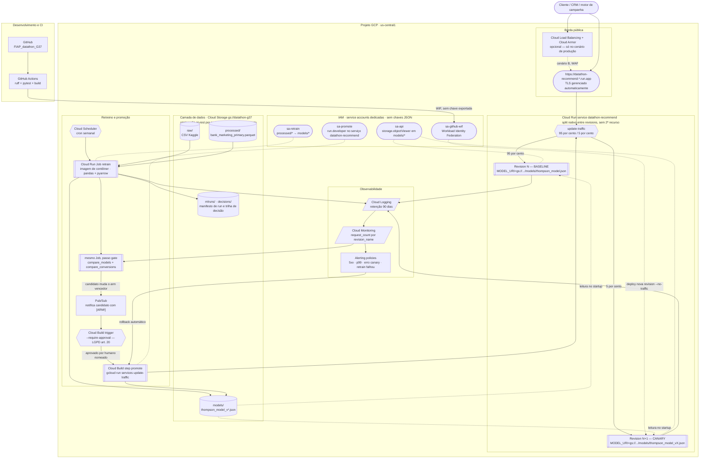

# Arquitetura de Referência — GCP

**Projeto:** Datathon FIAP G37 — recomendador de campanha por Thompson Sampling contextual
**Autor do desenho:** Grupo 37
**Data da elaboração:** 2026-08-05
**Região de referência:** `us-central1` (Iowa) — todos os preços citados são desta região, Tier 1, USD, preço de tabela on-demand

> **Nota de método.** Este documento é um desenho de referência, não um relatório de infraestrutura
> existente. Nada aqui está provisionado. Toda decisão de serviço foi tomada a partir do código real
> deste repositório (`src/datathon/api/app.py`, `scripts/retrain_model.py`, `scripts/compare_models.py`,
> `src/datathon/config.py`) e toda estimativa de custo vem de fonte oficial `cloud.google.com/*/pricing`
> com URL e data de consulta na seção 8. As páginas de preço da Google Cloud renderizam a tabela por
> JavaScript e não retornam o valor em uma leitura direta de página; por isso cada número da seção 8 foi
> cross-validado em pelo menos duas buscas independentes contra a mesma página oficial antes de entrar
> na tabela. Onde não foi possível confirmar um preço com essa confiança, isso está declarado
> explicitamente como **NÃO CONFIRMADO** em vez de estimado.

---

## 1. Visão geral

O sistema é um serviço de decisão de baixíssima leveza computacional: a API Flask (`/recommend`)
carrega em memória um modelo de 12 bandits Beta-Bernoulli persistido como um JSON de **~4,8 KB**
(`data/models/thompson_model.json`), e responde qual das 4 campanhas oferecer a um perfil
(`age_group` × `job_category`). O retreino (`scripts/retrain_model.py`) lê um parquet de **171 KB**
com ~41 mil linhas, roda um laço de atualização de posteriors em segundos, sem GPU e sem compute
distribuído. Na GCP, a peça central da arquitetura-alvo é uma única primitiva: **Cloud Run**, rodando
o mesmo container Flask que já existe hoje (`python app.py`, sem adaptador de runtime, ao contrário do
que a AWS exige com o Lambda Web Adapter). Cloud Storage guarda dados e artefatos, Cloud Scheduler
dispara o retreino em um Cloud Run Job dedicado, e Cloud Logging + Cloud Monitoring concentram
observabilidade. A decisão de não usar Vertex AI Training/Pipelines para o treino é análoga à decisão
já tomada para SageMaker (AWS) e Azure ML Compute (Azure) e pela mesma razão: um laço `pandas` de
segundos não paga o overhead de um serviço de ML gerenciado.

A peça que exige desenho cuidadoso — e é o diferencial mais forte da GCP neste projeto — é o
**canary deploy**. Diferente da AWS (que precisa combinar API Gateway + alias ponderado de Lambda) e
da Azure (que precisa de App Service em tier Standard/Premium só para habilitar *deployment slots*),
o **Cloud Run entrega roteamento de tráfego ponderado entre revisions como propriedade nativa do
mesmo recurso que já serve a API** — sem um segundo serviço de borda, sem tier pago obrigatório, sem
adaptador. A seção 4 detalha esse argumento com o mesmo rigor comparativo que os documentos AWS e
Azure já aplicaram aos mecanismos das suas respectivas nuvens.

---

## 2. Diagrama de arquitetura



**Leitura do fluxo em uma frase:** o cliente entra direto pela URL gerenciada do próprio Cloud Run
(ou por um Load Balancer com Cloud Armor, no cenário de produção), que divide o tráfego entre duas
*revisions* imutáveis do mesmo serviço — cada uma apontando para um arquivo de modelo diferente no
Cloud Storage — enquanto o Cloud Monitoring separa as métricas por `revision_name` e alimenta tanto o
gate estatístico de promoção quanto o alerta de rollback automático; a diferença estrutural para os
diagramas AWS e Azure é que aqui não existe um recurso de borda separado do recurso de compute — é o
mesmo Cloud Run service nas duas pontas.

---

## 3. Seleção de serviços e por quê

| Necessidade | Serviço GCP | Papel no desenho | Por que este e não uma alternativa mais pesada |
|---|---|---|---|
| Entrada HTTPS pública + serving do modelo | **Cloud Run (service)** | Roda o `app.py` Flask como está, sem adaptador; TLS gerenciado automaticamente na URL `*.run.app`; faz o canary de tráfego nativamente | O trabalho por requisição é sortear 4 amostras Beta com numpy sobre um dict de 12 contextos — microssegundos de CPU. Cloud Run fatura CPU só durante o processamento da requisição (billing "request-based", ver 8.1) e escala a zero sem custo ocioso. Um contêiner sempre ligado no GKE pagaria o cluster e os nós 24/7 para ficar ocioso. Vertex AI Endpoints é pior ainda: instância dedicada só para servir 4,8 KB de JSON. E, ao contrário da AWS, **não precisa de um segundo recurso de borda** — API Gateway não tem equivalente obrigatório aqui, porque o próprio Cloud Run já é HTTPS público gerenciado |
| Retreino batch | **Cloud Run Jobs** | Roda a lógica de `scripts/retrain_model.py` + `scripts/compare_models.py`: lê parquet do Cloud Storage, treina, versiona, escreve modelo, compara com produção | Treino de ~41 mil linhas em segundos cabe folgadamente no limite de 24 h de execução de um Job. **Cloud Run Jobs**, não uma segunda Cloud Run *service*, porque o retreino não é request-driven — é um script que roda até o fim e sai, exatamente a forma que Jobs foi desenhado para atender (ao contrário de uma *service*, que precisaria de um handler HTTP artificial só para receber o gatilho). **Vertex AI Training/Custom Jobs** cobraria provisionamento de nó de treino gerenciado para um laço de `df.iterrows()`; **Dataflow** e **Dataproc** são ordens de grandeza acima do problema |
| Armazenamento de dados e modelos | **Cloud Storage (Standard, regional)** | Bucket único com prefixos `raw/`, `processed/`, `models/`, `mlruns/`, `decisions/` | Volume total real é de dezenas de MB. Criptografia em repouso é **padrão e não opcional** no Cloud Storage — diferente da AWS/Azure, que exigem habilitar SSE/criptografia de conta explicitamente, aqui não há decisão a tomar. Versionamento de objeto dá rollback de modelo de graça. Filestore exigiria VPC; Cloud SQL/Firestore não agregam nada a artefatos imutáveis lidos uma vez por *cold start* |
| Gatilho de retreino | **Cloud Scheduler** | `cron` semanal (ou diário) chamando a API de execução do Cloud Run Job | 3 jobs grátis por conta de faturamento, e o restante custa **$0,10/job-mês** (não por execução — ver 8.1). **Cloud Composer (Airflow gerenciado)** custa centenas de dólares/mês de ambiente fixo para orquestrar um script de segundos; **Workflows** só se justificaria se o pipeline tivesse ramificação condicional real além de "roda o Job e publica no Pub/Sub se houver `[ARM!]`" |
| Split de tráfego canary | **`gcloud run services update-traffic`** entre *revisions* do mesmo serviço | Divide `/recommend` entre duas *revisions* imutáveis | Ver seção 4 — é o mecanismo mais direto entre as quatro opções levantadas, o único que não exige um segundo produto gerenciado ou um cluster para existir |
| Orquestração de promoção com aprovação humana | **Pub/Sub + Cloud Build trigger com `--require-approval`** | Publica quando o gate encontra `[ARM!]`; um humano nomeado aprova antes do passo de promoção rodar | Cloud Build tem um primitivo de aprovação de build **nativo da plataforma** (`roles/cloudbuild.builds.approve`), sem depender de um sistema externo de CI (diferente da Azure, que usa *GitHub Environments protection rules* — uma dependência do GitHub, não da nuvem) |
| Registro de imagens | **Artifact Registry** | Imagem de contêiner da API e do Job de retreino | Sucessor recomendado do Container Registry (legado); necessário para as duas imagens |
| Proteção da API | **Cloud Armor** (atrás de um Load Balancer HTTPS externo com Serverless NEG) | Rate limiting e regras gerenciadas (OWASP) | Recomendado apenas no cenário de produção (seção 8.4). No cenário acadêmico, a URL pública do Cloud Run com throttling de concorrência basta |
| Experiment tracking | **Cloud Monitoring + manifesto JSON no Cloud Storage** | Substitui o MLflow SQLite local (`.mlflow/mlflow.db`) | A GCP **não tem** um serviço equivalente ao "Azure ML Workspace como tracking MLflow nativo e sem custo de workspace" — o mais próximo é Vertex AI Experiments, que exige adicionar `google-cloud-aiplatform` como dependência nova (o projeto não a declara hoje) e ainda cobra pelo Cloud Storage subjacente e por execução de treino via Vertex, quando usado com Custom Jobs. Para este porte, replicar a solução da AWS — métricas no serviço de observabilidade nativo + artefato de execução versionado no object storage — é mais barato e não introduz dependência nova. Ver 9.5 |
| Logs, métricas e alertas | **Cloud Logging + Cloud Monitoring** | Logs com retenção de 90 dias (alinhada ao `LGPD_PLAN.md`), métricas por `revision_name`, políticas de alerta | Nativo do Cloud Run, sem agente. Métricas de plataforma (`run.googleapis.com/*`) são gratuitas — só métricas customizadas ou baseadas em log é que entram na cobrança de 8.1 |
| Credenciais | **Service accounts dedicadas + Workload Identity Federation** | Zero chaves JSON estáticas, em runtime e no CI | Ver seção 5 |

### 3.1 O que foi deliberadamente descartado

| Serviço | Por que não |
|---|---|
| **GKE (Standard ou Autopilot)** | Resolveria o canary via Gateway API (`HTTPRoute` com pesos em `backendRefs`), mas isso significa operar um cluster Kubernetes — mesmo no Autopilot, há uma taxa de gestão de cluster (~**$0,10/hora**, ver 8.1) cobrada independentemente de tráfego, mais o custo dos nós, para servir um JSON de 4,8 KB. É a mesma desproporção que levou a AWS a descartar ECS/Fargate como caminho principal |
| **Cloud Functions (2ª geração)** | Tecnicamente **herda** o mesmo mecanismo de *revisions* e traffic splitting do Cloud Run (são o mesmo runtime por baixo, confirmado no codelab oficial "Using revisions in Cloud Run functions for Traffic Splitting" — ver 10). Mas o modelo de programação é função-por-arquivo, não um `app.py` Flask completo com Swagger, CORS e múltiplas rotas. Não há vantagem em reescrever a API nesse formato quando o Cloud Run *service* já roda o container como está |
| **App Engine (splitting de tráfego por versão)** | Também tem *traffic splitting* nativo (`gcloud app services set-traffic --splits`), mas com duas desvantagens concretas: o split por IP tem variância declarada pela própria documentação (alvo de 5% pode entregar de fato entre 3–7%) e o split por cookie (`GOOGAPPUID`) pressupõe cliente de navegador — não se aplica bem a um consumidor server-to-server como um motor de campanha. Além disso é o produto para o qual a Google historicamente direciona clientes **para fora**, recomendando Cloud Run para novos serviços. Ver comparação completa em 4.2 |
| **Vertex AI Training / Pipelines / Custom Jobs** | Decisão análoga à já registrada para SageMaker (AWS) e Azure ML Compute (Azure): o treino roda em segundos sobre 171 KB de parquet, sem GPU, sem paralelismo |
| **Vertex AI Endpoints** | Instância dedicada 24/7 (ou autoscaling com mínimo de 1 réplica) para servir um JSON de 4,8 KB |
| **Vertex AI Experiments / managed MLflow** | Exigiria adicionar `google-cloud-aiplatform` como dependência nova — ao contrário da Azure, onde `azureml-mlflow` **já é** dependência declarada em `requirements.txt`. Ver 9.5 |
| **VPC / Direct VPC Egress para o Cloud Run de serving** | Não há nenhum recurso privado a alcançar — Cloud Storage e Cloud Monitoring são acessados via API pública autenticada por IAM, com *Private Google Access* disponível se um dia houver necessidade. Uma VPC aqui adicionaria configuração sem ganho de segurança real, mesma lógica do §5.3 do documento AWS |

---

## 4. Canary deploy na GCP

### 4.1 O que existe hoje no código

`src/datathon/api/app.py` implementa o canary **dentro do processo**:

- dois modelos carregados em memória (`MODEL` e `CANARY_MODEL`, via `load_model_from_path`, linha 163);
- roteamento por `random.random() < (CANARY_CONFIG['canary_percentage'] / 100)` (linha 532);
- contadores em um dicionário Python (`CANARY_CONFIG['metrics']`, linha 68);
- gate estatístico com `compare_conversions` (qui-quadrado) exposto em `GET /canary/metrics` (linha 601);
- `POST /canary/promote` (linha 681) e `POST /canary/rollback` (linha 720) apenas desligam a flag
  `CANARY_CONFIG['enabled']` e zeram os contadores — nenhum artefato é de fato promovido.

Esse padrão é didaticamente correto e sustenta o roteiro de vídeo do `CANARY_DEMO_GUIDE.md`, mas tem
as mesmas três propriedades que não sobrevivem a mais de uma instância, já documentadas nos desenhos
AWS e Azure: o split é local ao processo, os contadores são memória local, e `model.update(...)`
(linha 557) muta o posterior em memória e o descarta no fim do processo. Na GCP, cada uma dessas
responsabilidades também precisa de um dono explícito de infraestrutura — a pergunta que este
documento resolve é **qual mecanismo GCP é esse dono**.

### 4.2 Levantamento: o que cada serviço realmente suporta

| Mecanismo | Suporta split por peso? | Duração do split | Observação factual |
|---|---|---|---|
| **Cloud Run — `update-traffic` entre revisions** | **Sim**, granularidade de 1% via `--to-revisions REV1=95,REV2=5` | **Indefinida** — "if you split traffic between multiple revisions... all subsequent deployments use that traffic split pattern going forward" (doc oficial) | Sem mínimo de tráfego imposto; suporta *tags* de revision para acesso direto sem split (`https://TAG---service-hash.run.app`), permitindo QA no candidato com 0% de tráfego real antes de abrir o split. Sem custo adicional — paga-se apenas o compute de cada revision conforme recebe tráfego |
| **Cloud Run functions (2ª gen)** | **Sim**, mesmo mecanismo do Cloud Run (é o mesmo runtime por baixo) | Indefinida, idêntica ao Cloud Run | Herdado, não é um mecanismo distinto — mas o modelo de programação função-por-arquivo não serve bem a um `app.py` Flask completo (ver 3.1) |
| **App Engine — `set-traffic --splits`** | **Sim**, por IP ou por cookie (`GOOGAPPUID`) | Indefinida | Split por IP tem variância documentada ("the resulting split will differ somewhat... between 3–7%" para um alvo de 5%) — o mesmo aviso de baixa precisão em baixo volume que a AWS documenta para o alias ponderado de Lambda. Split por cookie não se aplica bem a cliente server-to-server. É o produto legado da plataforma serverless da Google, do qual novos projetos são ativamente direcionados para o Cloud Run |
| **GKE — Gateway API (`HTTPRoute` com `backendRefs` ponderados)** | **Sim**, granularidade arbitrária via peso relativo | Indefinida | Funciona, mas exige **operar um cluster** — taxa de gestão de $0,10/hora cobrada independente de tráfego, mais os nós. Não é uma propriedade do "serviço", é configuração de rede sobre uma camada de orquestração inteira |
| **Cloud Deploy — canary de implantação (progressão automática)** | Sim, percentuais configuráveis (ex.: 10% → 50% → 100%) | **Limitada por natureza** — desenhado para *bake time* entre fases, não para um experimento estatístico de duração arbitrária | É um mecanismo de *deployment progressivo*, não de *experimento*: a progressão avança por tempo/aprovação de fase, não por acúmulo de significância estatística sobre conversão |

### 4.3 Mecanismo recomendado

> **Recomendação: Cloud Run nativo — `gcloud run services update-traffic` entre duas *revisions*
> imutáveis do mesmo serviço, com o peso controlado pelo pipeline de gate, não por uma progressão
> automática por tempo.**

O argumento decisivo é o mesmo que orientou a recomendação AWS e Azure: o gate de `/canary/metrics`
não é uma condição temporal ("sem erro nos últimos N minutos") — é um teste qui-quadrado sobre
conversões acumuladas, que só conclui quando há **volume** suficiente. Um canary de Cloud Deploy
avançaria de fase após um *bake time* fixo, independentemente de haver 30 ou 30 mil observações. Já o
`update-traffic` ajustado manualmente (ou por script) pode ficar em 95/5 por dias, até o teste atingir
poder estatístico — a tradução fiel de `CANARY_CONFIG` para infraestrutura.

O segundo argumento é estrutural, e é o que diferencia a GCP das outras duas nuvens: **não existe um
segundo recurso de borda a coordenar**. Na AWS, o canary precisa de API Gateway (fixo) + alias
ponderado de Lambda (fixo) — dois recursos, dois modelos de configuração. Na Azure, precisa de App
Service em tier Standard/Premium — só para *habilitar* slots, um item de custo por si (ver AZURE.md
§8.3). No Cloud Run, o **mesmo `gcloud run deploy`** que publica o código também cria a *revision*, e
o **mesmo serviço** que responde `/recommend` é o que faz o split. Uma *revision*, por definição, é um
"snapshot imutável de código e configuração" — a mesma semântica de versão imutável que a AWS usa para
justificar o alias de Lambda, sem precisar de dois produtos:

```bash
# 1. publica a nova revision com o modelo candidato, SEM expor tráfego a ela
#    (a env var MODEL_URI é parte da configuração — snapshot imutável, igual à
#    variável de ambiente na versão de Lambda no documento AWS)
gcloud run deploy datathon-recommend \
  --image us-central1-docker.pkg.dev/datathon-g37/api/datathon-recommend:latest \
  --set-env-vars MODEL_URI=gs://datathon-g37/models/thompson_model_v20260805_031500.json \
  --no-traffic --tag canary

# 2. QA interno via a URL da tag, sem tráfego real (equivalente ao smoke test
#    do slot canary da Azure com x-ms-routing-name, mas sem precisar de cookie)
curl https://canary---datathon-recommend-abc123.a.run.app/health

# 3. abre 5% do tráfego real para a revision candidata -> equivale a POST /canary/start
gcloud run services update-traffic datathon-recommend \
  --to-revisions candidate-v20260805=5,LATEST=95
```

O mapeamento fica um-para-um com os endpoints já existentes:

| Endpoint atual (`app.py`) | Equivalente GCP |
|---|---|
| `POST /canary/start` com `canary_percentage` | `gcloud run deploy --no-traffic --tag canary` (publica sem expor) + `gcloud run services update-traffic --to-revisions candidate=5,LATEST=95` |
| Roteamento por `random.random()` | Roteamento ponderado do próprio Cloud Run, na borda — o código deixa de sortear |
| `CANARY_CONFIG['metrics']` (dict em memória) | Métrica nativa `run.googleapis.com/request_count` + métrica baseada em log para conversão, ambas com o label `revision_name` (ver 6.2) |
| `GET /canary/metrics` | Consulta Cloud Monitoring por `revision_name` + `compare_conversions` rodando no Cloud Run Job de gate |
| `POST /canary/promote` | `gcloud run services update-traffic --to-revisions candidate=100` + cópia do JSON promovido para `models/thompson_model.json` no Cloud Storage |
| `POST /canary/rollback` | `gcloud run services update-traffic --to-revisions baseline=100` — reversível em segundos porque a *revision* anterior já está publicada e (se configurada com instância mínima) quente |

**Atribuição por requisição** (qual *revision* respondeu) vem de duas formas nativas, sem precisar
inferir nada: a env var `K_REVISION`, injetada automaticamente pelo runtime do Cloud Run em todo
container, pode ser lida dentro do handler Flask e devolvida no campo `model_version` da resposta —
que **já existe** em `/canary/recommend` (linha 586 de `app.py`) — e o log de acesso do Cloud Run
já rotula cada requisição com `revision_name` sem nenhuma instrumentação adicional.

### 4.4 Quando usar cada mecanismo (não é "um ou outro")

- **Mudança de código** (nova rota, bump de dependência): rollout padrão do Cloud Run
  (`gcloud run deploy`, tráfego migra 100% para a nova *revision* por padrão) com um smoke test antes
  do deploy. Se o time quiser um *bake time* automatizado por fase, **Cloud Deploy** é o produto
  desenhado para isso — mas não é o caso do canary de modelo.
- **Mudança de modelo** (novo `thompson_model_vX.json`): `update-traffic` sob controle do pipeline de
  gate (7.2). O critério é estatístico e pode levar dias. É exatamente o caso `Young_Technical`
  descrito em `CANARY_DEMO_GUIDE.md`, em que o retreino com o dataset completo inverte o arm vencedor
  (Email_Campaign, 10,72% → Cellular_Standard, 19,66%) com um ganho de +8,94 pp. O efeito é grande,
  mas o gate não sabe disso de antemão — só o teste estatístico sobre tráfego real acumulado ao longo
  de dias distingue esse caso de um retreino que produzisse apenas ruído de amostragem do posterior
  Beta.

### 4.5 Uma ressalva sobre manter a *revision* candidata "quente"

Por padrão o Cloud Run escala cada *revision* a zero de forma independente. Se o baseline recebe 95%
do tráfego e o candidato 5%, e o volume total for baixo (cenário A, seção 8.2), é possível que a
*revision* candidata sofra *cold start* a cada nova rajada de tráfego — porque ela não acumula
instâncias ociosas quentes na mesma proporção do baseline. A correção, se isso importar para a
demonstração, é configurar `--min-instances=1` **na revision candidata especificamente** durante a
janela de canary — o que tem custo (billing por instância sempre alocada, não só por requisição, ver
8.1) e deve ser revertido ao fim do experimento. Isso não é um defeito do mecanismo, é uma
característica do modelo de escala a zero que sustenta o custo baixíssimo do cenário A — e é o
trade-off inverso ao problema de *cold start* documentado no §9.4 da AWS, que lá é permanente porque
não há opção de instância mínima gratuita em nenhuma abordagem serverless.

---

## 5. Segurança e governança

### 5.1 IAM com privilégio mínimo — quatro identidades distintas

Nenhuma delas usa uma chave JSON de service account exportada. Todas são atribuídas por *runtime
identity* do Cloud Run/Cloud Build ou por Workload Identity Federation.

| Service account | Anexada a | Papéis (escopo de recurso, não de projeto) |
|---|---|---|
| `sa-api@datathon-g37.iam` | *revisions* do Cloud Run `datathon-recommend` | `roles/storage.objectViewer` **condicionado** ao prefixo `models/*` do bucket (via *IAM Condition* com `resource.name.startsWith`) · **sem** permissão de escrita, **sem** acesso a `processed/` |
| `sa-retrain@datathon-g37.iam` | Cloud Run Job `retrain` | `roles/storage.objectViewer` em `raw/*` e `processed/*` · `roles/storage.objectCreator` em `models/*` e `mlruns/*` · `roles/monitoring.metricWriter` restrito à métrica customizada do namespace do projeto |
| `sa-promote@datathon-g37.iam` | passo `promote` do Cloud Build | `roles/run.developer` **no serviço `datathon-recommend` especificamente** (via *IAM Condition* por nome de recurso) — permite `update-traffic` e `deploy`, não permite mexer em outros serviços do projeto · `roles/storage.objectAdmin` em `models/*` |
| `sa-github-wif@datathon-g37.iam` | GitHub Actions via **Workload Identity Federation** | `roles/artifactregistry.writer` (push de imagem) · `roles/run.developer` no serviço, condicionado ao atributo `attribute.repository == 'org/FIAP_datathon_G37'` do *Workload Identity Pool* |

A separação entre `sa-api` e `sa-promote` é o controle mais importante do desenho, igual ao AWS.md:
**a identidade que atende o cliente não tem permissão de mudar para onde o tráfego vai**. Um
comprometimento do container de serving não consegue chamar `update-traffic`.

**Workload Identity Federation**, não uma chave de service account exportada como secret do GitHub:
o GitHub emite um token OIDC de curta duração por execução do workflow, trocado por credenciais
temporárias da GCP via um *Workload Identity Pool* — nenhum segredo estático em nenhum dos dois
lados. É funcionalmente equivalente ao `github-oidc-role` da AWS e ao *federated credential* da
Azure.

### 5.2 Dados em repouso e em trânsito

- **Cloud Storage**: criptografia em repouso com chaves gerenciadas pela Google está **ligada por
  padrão e não pode ser desligada** — ao contrário de AWS (SSE-S3 precisa ser habilitada) e Azure
  (depende da configuração da conta), aqui não há decisão de configuração a auditar. Acesso público
  a objetos é bloqueado por padrão em buckets criados sem uma política explícita de acesso uniforme;
  versionamento de objeto (`gsutil versioning set on`) é o mecanismo de rollback de modelo, mesmo
  papel que o versionamento de bucket cumpre no S3.
- **Em trânsito**: TLS terminado automaticamente na URL `*.run.app` do Cloud Run — HTTPS é a única
  opção para tráfego público, não existe um "modo HTTP" a desligar (diferente da AWS, onde TLS é
  configuração do API Gateway, e da Azure, onde é preciso marcar "HTTPS Only" explicitamente no App
  Service).
- **Segredos**: como nos outros dois desenhos, este projeto **não precisa** de Secret Manager para
  operar — não há credencial de banco nem token de terceiros no caminho de serving ou retreino. Tudo
  é IAM. Se o time optar por reintroduzir a chave da API do Kaggle (`.env.example` já lista
  `KAGGLE_KEY`) no pipeline de ingestão, aí sim o Secret Manager entra — ver custo em 8.1.

### 5.3 Fronteira de rede — por que não há VPC no caminho de serving

O Cloud Run de serving conversa apenas com Cloud Storage e Cloud Monitoring, ambos acessíveis por API
pública autenticada por IAM. Colocá-lo atrás de *Direct VPC Egress* não fecharia nenhuma superfície de
ataque real — o acesso ao bucket já é negado por padrão a qualquer principal sem o papel IAM
correspondente. A fronteira de segurança real aqui é **IAM + condições de recurso**, não topologia de
rede — mesma conclusão do AWS.md §5.3 e do AZURE.md §5.3. Uma VPC (com *Serverless VPC Access* ou
*Direct VPC Egress*) só se justifica no dia em que houver um Cloud SQL ou Memorystore no caminho.

### 5.4 LGPD

A postura de dados não é redefinida aqui — ela está em [`docs/LGPD_PLAN.md`](../LGPD_PLAN.md) e este
desenho apenas **implementa** os controles que aquele documento especifica:

| Controle definido no `LGPD_PLAN.md` | Como esta arquitetura o realiza |
|---|---|
| Retenção de log de recomendação: 90 dias | *Log bucket* do Cloud Logging configurado com `retention-days=90`; regra de ciclo de vida (`gsutil lifecycle`) no prefixo `decisions/` do Cloud Storage |
| Log deve conter `decision_id`, contexto agregado, `model_version`, `rationale` | Log estruturado em JSON (Cloud Logging aceita JSON estruturado nativamente, com campos indexáveis), com `model_version` derivado de `K_REVISION` |
| Log **não** deve conter identificadores nem o payload completo | O handler serializa apenas os campos do contrato; nunca o corpo bruto da requisição |
| Revisão humana na mudança de política (art. 20) | O gate do Cloud Build trigger com `--require-approval` (§7.2) é o ponto de aprovação nomeada — a promoção não é totalmente automática por desenho, e a aprovação fica registrada no histórico do Cloud Build com identidade do aprovador |
| Sem buckets públicos, credenciais por IAM | Seções 5.1 e 5.2 |

### 5.5 Achados no código atual que afetam a implantação na GCP

`src/datathon/config.py` **não tem nenhum ramo para GCP** — é o achado mais direto dos três desenhos
de nuvem deste repositório, e mais severo que o equivalente na AWS ou na Azure porque lá pelo menos
existe um `Environment.AWS` / `Environment.AZURE` com lógica (ainda que incorreta) tentando lidar com
a nuvem. Aqui:

1. **`Environment` (linhas 28–32) só tem `LOCAL`, `AWS`, `AZURE`.** Não existe `Environment.GCP`.
   Rodando dentro de um container no Cloud Run, `_detect_environment()` (linhas 57–77) checa
   `AWS_ACCESS_KEY_ID`/`AWS_SECRET_ACCESS_KEY` e `AZURE_SUBSCRIPTION_ID` — nenhuma dessas variáveis
   existe no ambiente do Cloud Run — e cai no `return Environment.LOCAL` do final da função. Isso
   acontece **mesmo que `DATATHON_ENV=gcp` seja definido explicitamente**, porque
   `Environment(override.lower())` (linha 61) lançaria `ValueError: 'gcp' is not a valid Environment`
   antes de chegar a qualquer lógica de fallback — ou seja, hoje é literalmente impossível configurar
   este código para se comportar como se estivesse na GCP sem editar o enum primeiro.
2. **Consequência prática: o código roda em modo LOCAL dentro do container.** `_setup_paths()`
   (linhas 79–120) cai no ramo `Environment.LOCAL`, monta `project_root = Path(__file__).parent.parent.parent`
   — um caminho *dentro do container*, que existe porque a imagem Docker copia o código-fonte, mas que
   **não aponta para o Cloud Storage**. O `mkdir(parents=True, exist_ok=True)` final da função
   (linha 120) **não lança exceção** (o filesystem do Cloud Run é gravável — um detalhe que diverge do
   Lambda, cujo filesystem é somente leitura fora de `/tmp`, achado equivalente no AWS.md §5.5).
   Isso é, paradoxalmente, **mais perigoso** que o caso da AWS: em vez de derrubar a função com um erro
   alto e visível (`OSError: Read-only file system`), o código sobe normalmente e serve a partir de um
   diretório local vazio ou desatualizado dentro da imagem — uma falha silenciosa, sem crash, sem log
   de erro, que só aparece quando alguém nota que o modelo nunca reflete o último retreino.
3. **`_setup_storage()` e `_setup_ml_tracking()` (linhas 122–178) não têm ramo `elif self.env ==
   Environment.GCP`.** Não há nenhuma linha do código que instancie um cliente `google-cloud-storage`
   ou resolva uma URI `gs://`. `google-cloud-storage` também não está em `requirements.txt`.

A correção mínima para tornar este desenho implementável é, em ordem: (a) adicionar `GCP = "gcp"` ao
enum `Environment`; (b) em `_detect_environment()`, checar a variável `K_SERVICE` — injetada
automaticamente pelo runtime do Cloud Run em todo container, portanto um sinal de ambiente confiável e
sem necessidade de credencial — como sinal auxiliar, mas **preferir sempre `DATATHON_ENV=gcp`
explícito** na configuração da *revision* (mesma recomendação do AWS.md §5.5, pela mesma razão: fica
parte do snapshot imutável e é auditável); (c) adicionar os ramos `elif self.env == Environment.GCP`
em `_setup_paths`, `_setup_storage` e `_setup_ml_tracking`, resolvendo `gs://` via
`google.cloud.storage.Client()`, que herda a *service account* do Cloud Run automaticamente (sem
credencial explícita no código, mesma ergonomia do `DefaultAzureCredential` citado no AZURE.md §5.1).
Este documento registra o achado; a correção do Python está fora do escopo deste desenho de
arquitetura, por instrução explícita do time.

---

## 6. Observabilidade

### 6.1 Métricas nativas (sem custo de instrumentação)

| Origem | Métricas | Uso |
|---|---|---|
| Cloud Run | `run.googleapis.com/request_count`, `request_latencies`, `container/cpu/utilizations`, `container/memory/utilizations`, `container/instance_count` — todas com o label **`revision_name`** | Comparar saúde técnica de baseline vs. canary sem escrever nenhuma linha de instrumentação. Métricas de plataforma (`run.googleapis.com/*`) **não entram** na cobrança de métrica customizada (ver 8.1) |
| Cloud Run Job | `run.googleapis.com/job/completed_task_attempt_count`, duração de execução | Detecta retreino que falhou silenciosamente |

### 6.2 Métricas de negócio via log-based metrics

O sinal que importa neste projeto — taxa de conversão por *revision* — não é nativo. A forma mais
barata de obtê-lo é uma **métrica baseada em log** (*logs-based metric*): a API escreve um JSON
estruturado no Cloud Logging e uma métrica de contador/distribuição é extraída dele — sem uma chamada
`createTimeSeries` por requisição, e sem o custo de métrica customizada por MiB da seção 8.1 (o custo
já pago é o de ingestão de log, que a API paga de qualquer forma pela retenção de 90 dias exigida pelo
`LGPD_PLAN.md`).

| Métrica derivada do log | Semântica |
|---|---|
| `datathon/decisions` (counter) | Recomendações emitidas, com o label extraído `revision_name` |
| `datathon/conversions` (counter) | Conversões confirmadas (ver 9.3 sobre a chegada assíncrona do desfecho real) |
| `datathon/model_age` (distribuição) | Idade do artefato carregado — detecta modelo obsoleto |

**Disciplina de cardinalidade — o mesmo ponto que o AWS.md faz para EMF:** é tentador extrair
`age_group` e `job_category` como labels da métrica, mas isso multiplica por 12 o número de séries
temporais de uma métrica baseada em log (que, ao contrário das métricas de plataforma, **é**
chargeable se o volume ultrapassar os 150 MiB grátis de ingestão de métrica por conta de faturamento).
O contexto completo fica **no corpo do log estruturado**, consultável por Cloud Logging *ad hoc*
quando necessário, e **fora dos labels da métrica**.

### 6.3 Alertas

Desde que a Google passou a cobrar por política de alerta (ver 8.1), o desenho consolida condições em
poucas políticas em vez de uma política por sinal — a própria documentação da Google recomenda isso
como controle de custo.

| Alerta | Condição | Ação |
|---|---|---|
| `api-5xx` | `request_count` com `response_code_class="5xx"` > 1% em 5 min, por `revision_name` | Notifica via Pub/Sub |
| `api-latency-p99` | `request_latencies` p99 > 1 s por 3 períodos | Notifica |
| `canary-error-rate` | Taxa de erro da *revision* candidata > 2× a do baseline | **Aciona `update-traffic --to-revisions baseline=100`** via Cloud Function assinante do alerta — o `POST /canary/rollback` automático |
| `retrain-failed` | Execução do Cloud Run Job `retrain` termina com status de falha | Notifica |
| `model-stale` | `datathon/model_age` acima de 2× o intervalo de retreino | Notifica — pega o Cloud Scheduler silenciosamente quebrado |

### 6.4 Logs

Um *log bucket* dedicado no Cloud Logging (fora do `_Default` do projeto, para não competir por
retenção com logs de outros serviços), retenção de **90 dias** (número herdado do `LGPD_PLAN.md`, não
escolhido aqui). Log de decisão em JSON estruturado de uma linha, com `decision_id` (UUID), timestamp,
contexto agregado, arm, taxa esperada e `K_REVISION` como `model_version` — o schema da seção 6 do
`LGPD_PLAN.md`, hoje especificado mas não implementado. Análise *ad hoc* por Log Analytics (SQL sobre
o *log bucket*, incluso na ingestão); sem BigQuery dedicado, que só se pagaria com um volume muito
maior.

---

## 7. CI/CD e automação do retreino

Duas esteiras independentes, mesma razão que nos outros dois desenhos: mudam por motivos diferentes e
em cadências diferentes.

### 7.1 Esteira de código (dispara em `git push`)

```
push em main
  └─ GitHub Actions
       ├─ ruff check + pytest (tests/ já existe no repo)
       ├─ docker build da imagem da API
       ├─ autentica via Workload Identity Federation  ← sem chave JSON nos secrets
       ├─ docker push para o Artifact Registry
       └─ gcloud run deploy --no-traffic --tag ci-<sha>
              ← publica a revision, mas NÃO expõe tráfego a ela
```

O último passo é o detalhe que importa, igual ao equivalente AWS: publicar uma *revision* **não**
expõe ninguém a ela por padrão quando feito com `--no-traffic`. Quem move tráfego é sempre a esteira
de modelo (7.2) ou um `gcloud run deploy` normal (sem a flag) para mudanças de código já validadas.
Isso torna "deploy" e "release" eventos separados, mesma disciplina do AWS.md §7.1.

### 7.2 Esteira de modelo (dispara no cron ou sob demanda)

```
Cloud Scheduler (cron semanal)
  └─ gcloud run jobs execute retrain
       ├─ lê gs://datathon-g37/processed/bank_marketing_primary.parquet
       ├─ treina (mesma lógica de ModelTrainer.train)
       ├─ escreve gs://.../models/thompson_model_v20260805_031500.json
       │     (sufixo idêntico ao de ModelVersionManager.get_version_suffix(): v%Y%m%d_%H%M%S)
       ├─ publica manifesto de run (métricas + parâmetros) em mlruns/
       └─ roda o passo gate (lógica de scripts/compare_models.py)
            ├─ nenhuma troca de arm e métricas estáveis → arquiva o candidato, fim
            └─ há troca de arm em algum contexto ([ARM!]) → publica no Pub/Sub
                                                                │
                      ┌─────────────────────────────────────────┘
                      ▼
                 Cloud Build trigger (assinante do tópico Pub/Sub)
                   status: "Awaiting approval"        ← LGPD art. 20 (5.4)
                      │  aprovado por humano com papel roles/cloudbuild.builds.approve
                      ▼
                 passo promote  =  POST /canary/start
                   1. gcloud run deploy --no-traffic --tag candidate
                        --set-env-vars MODEL_URI=<novo>
                   2. gcloud run services update-traffic
                        --to-revisions candidate=5,LATEST=95
                      │
                      ▼   (janela de observação: horas ou dias, não minutos)
                 consulta Cloud Monitoring por revision_name
                   compare_conversions(...)  =  GET /canary/metrics
                      │
          ┌───────────┴────────────┐
          ▼                        ▼
   should_promote = true     canary pior / alerta canary-error-rate
   = POST /canary/promote    = POST /canary/rollback
   update-traffic             update-traffic
     --to-revisions              --to-revisions
     candidate=100                baseline=100
   + cópia do JSON para       (disparado também automaticamente
     thompson_model.json       pelo alerta canary-error-rate, 6.3)
```

Três propriedades desse fluxo merecem destaque, na mesma linha dos outros dois desenhos:

1. **O gate é o caso `Young_Technical`.** O critério de escalar para canary não é "houve retreino", é
   "o candidato **muda a oferta recomendada** em algum contexto" — `scripts/compare_models.py` já
   marca isso com `[ARM!]`. Retreinos que só ajustam a terceira casa decimal do posterior não
   consomem aprovação humana nem risco de tráfego.
2. **A aprovação humana é estrutural, não burocrática, e é nativa da plataforma de build.** O gate
   `--require-approval` do Cloud Build materializa a "revisão humana" do art. 20 do `LGPD_PLAN.md` sem
   depender de um sistema externo — diferente da Azure, cujo desenho usa uma *protection rule* do
   GitHub Environments (uma dependência do GitHub, não da GCP).
3. **Promover é uma chamada de API, não um deploy.** `update-traffic` é atômico e reversível em
   segundos, sem rebuild, sem nova imagem — porque as duas *revisions* já estão publicadas.

---

## 8. Estimativa de custos

> **Como ler esta seção.** As páginas oficiais de preço da GCP (`cloud.google.com/*/pricing`)
> renderizam a tabela por JavaScript; uma leitura direta de página frequentemente retorna a casca
> HTML sem os valores. Por isso, cada preço abaixo foi obtido por no mínimo duas buscas independentes
> contra a mesma página oficial, e os valores de free tier foram confirmados por leitura direta da
> página `cloud.google.com/free/docs/free-cloud-features`. Onde não foi possível alcançar esse nível
> de confiança, está escrito **NÃO CONFIRMADO** — sem número inventado. Todas as consultas foram
> feitas em **2026-08-05**, região `us-central1`, USD, preço de tabela sem descontos de compromisso.

### 8.1 Preços unitários confirmados

| Serviço | Preço unitário confirmado | Fonte | Free tier mensal |
|---|---|---|---|
| Cloud Run — CPU (Tier 1, billing por requisição) | **$0,000024** por vCPU-segundo | [cloud.google.com/run/pricing](https://cloud.google.com/run/pricing), consultado 2026-08-05 | 180.000 vCPU-s |
| Cloud Run — memória | **$0,0000025** por GiB-segundo | mesma fonte | 360.000 GiB-s |
| Cloud Run — requisições | **$0,40** por milhão | mesma fonte | 2.000.000 requisições |
| Cloud Run — egress | tarifa padrão de rede da GCP (ver linha de egress abaixo) | mesma fonte | 1 GB saindo da América do Norte |
| Cloud Storage Standard (regional, US) — armazenamento | **$0,020** por GB-mês | [cloud.google.com/storage/pricing](https://cloud.google.com/storage/pricing), consultado 2026-08-05 | 5 GB-mês |
| Cloud Storage — Class A ops (write/list) | **$0,05** por 10.000 | mesma fonte | 5.000 ops |
| Cloud Storage — Class B ops (read) | **$0,004** por 10.000 | mesma fonte | 50.000 ops |
| Cloud Storage — egress para internet | 100 GB grátis, depois tarifa padrão de rede | mesma fonte | 100 GB |
| Rede — egress para internet (Premium Tier) | **$0,12/GB** até 1 TB, **$0,11/GB** de 1–10 TB, **$0,08/GB** acima de 10 TB | [cloud.google.com/network-tiers/pricing](https://cloud.google.com/network-tiers/pricing), consultado 2026-08-05 | 1 GB (Cloud Run) / 100 GB (Cloud Storage), não cumulativos entre si |
| Cloud Run Jobs | mesma tabela de CPU/memória do Cloud Run (billing pela duração total da execução, não só request-based) | [cloud.google.com/run/pricing](https://cloud.google.com/run/pricing) | mesma franquia agregada do Cloud Run |
| Cloud Scheduler | **$0,10** por job-mês (não por execução) | [cloud.google.com/scheduler/pricing](https://cloud.google.com/scheduler/pricing), consultado 2026-08-05 | 3 jobs por conta de faturamento |
| Cloud Logging — ingestão | **$0,50** por GiB | [cloud.google.com/stackdriver/pricing](https://cloud.google.com/stackdriver/pricing), consultado 2026-08-05 | 50 GiB por projeto |
| Cloud Logging — retenção além de 30 dias | **$0,01** por GiB-mês | mesma fonte | inclusos os primeiros 30 dias |
| Cloud Monitoring — métrica customizada / log-based | **$0,2580** por MiB até 100.000 MiB, depois $0,1510/MiB, depois $0,0610/MiB | mesma fonte | 150 MiB por conta de faturamento |
| Cloud Monitoring — alerting policy | **$0,35** por referência de métrica/mês + **$0,50** por milhão de pontos retornados/mês (políticas *log-based* não pagam pontos) | [cloud.google.com/stackdriver/observability-pricing-examples](https://cloud.google.com/stackdriver/observability-pricing-examples), consultado 2026-08-05 | sem franquia dedicada — soma-se à franquia de 150 MiB de métrica |
| Artifact Registry — armazenamento | **$0,10** por GB-mês | [cloud.google.com/artifact-registry/pricing](https://cloud.google.com/artifact-registry/pricing), consultado 2026-08-05 | 0,5 GB |
| Cloud Build — build-minuto (`e2-standard-2`, pool padrão) | **$0,006**/minuto | [cloud.google.com/build/pricing](https://cloud.google.com/build/pricing), consultado 2026-08-05 | 2.500 minutos/mês |
| Secret Manager — versão ativa | **$0,06** por versão-mês | [cloud.google.com/secret-manager/pricing](https://cloud.google.com/secret-manager/pricing), consultado 2026-08-05 | 6 versões ativas |
| Secret Manager — operações de acesso | **$0,03** por 10.000 | mesma fonte | 10.000 operações |
| Pub/Sub — throughput | **$40** por TiB | [cloud.google.com/pubsub](https://cloud.google.com/pubsub), consultado 2026-08-05 | 10 GB |
| GKE Autopilot — vCPU / memória | **$0,0445**/vCPU-hora + **$0,0049**/GiB-hora | [cloud.google.com/kubernetes-engine/pricing](https://cloud.google.com/kubernetes-engine/pricing), consultado 2026-08-05 | crédito de $74,40/mês contra a taxa de gestão de cluster |
| GKE — taxa de gestão de cluster (todos os modos) | **$0,10**/cluster-hora | mesma fonte | coberta pelo crédito acima, ~1 cluster |
| Workload Identity Federation, IAM, service accounts | sem cobrança | consistente com a ausência de item de preço dedicado nas páginas oficiais consultadas | — |

> **Sobre o free program.** Múltiplas fontes consultadas em 2026-08-05 (incluindo referências
> cruzadas à página `cloud.google.com/free`) descrevem um crédito de **$300 válido por 90 dias** para
> clientes novos, além do **Always Free tier** perpétuo cujos limites estão na tabela acima. A leitura
> direta da página `cloud.google.com/free` não retornou o texto integral (mesma limitação de
> renderização por JavaScript); por isso o valor do crédito promocional está registrado como
> cross-validado, não como leitura primária de página — e os cálculos abaixo **não** dependem dele,
> só do Always Free tier, cujos números vêm de `cloud.google.com/free/docs/free-cloud-features`, lida
> diretamente.

### 8.2 Cenário A — mínimo acadêmico / demo

**Premissas (ajustar conforme o uso real):**

| Premissa | Valor |
|---|---|
| Chamadas a `/recommend` | 1.000/dia ≈ **30.000/mês** (banca, vídeo de demo, testes) |
| Retreino | **semanal** → ~4,3 execuções/mês |
| Duração faturada do Cloud Run de serving | 50 ms a 512 MiB *(estimativa — não medida em Cloud Run)* |
| Duração do Cloud Run Job de retreino | 60 s a 2 GiB *(estimativa; o treino local roda em segundos)* |
| Dados no Cloud Storage | ~50 MB (CSVs Kaggle 18 MB + parquets 1,8 MB + modelos versionados) |
| Domínio customizado / Cloud Armor | não |

| Item | Cálculo | US$/mês |
|---|---|---|
| Cloud Run serving — requisições | 30.000 (dentro de 2 mi grátis) | **0,00** |
| Cloud Run serving — CPU | 30.000 × 0,05 s × 1 vCPU = 1.500 vCPU-s (grátis até 180.000) | **0,00** |
| Cloud Run serving — memória | 30.000 × 0,05 s × 0,5 GiB = 750 GiB-s (grátis até 360.000) | **0,00** |
| Cloud Run Job retrain — CPU | 4,3 × 60 s × 2 vCPU ≈ 516 vCPU-s (mesma franquia agregada) | **0,00** |
| Cloud Run Job retrain — memória | 4,3 × 60 s × 2 GiB ≈ 516 GiB-s (mesma franquia) | **0,00** |
| Cloud Storage — armazenamento | 0,05 GB × $0,020 | **0,00** |
| Cloud Storage — operações | ~500 leituras (cold starts) + ~50 escritas | **0,00** |
| Cloud Logging | < 1 GiB (grátis até 50 GiB) | **0,00** |
| Cloud Monitoring — métrica log-based | tráfego baixo, bem abaixo de 150 MiB grátis | **0,00** |
| Cloud Monitoring — alerting (5 políticas, 1 referência cada) | 5 × $0,35 = $1,75; pontos desprezíveis nesse volume | **1,75** |
| Artifact Registry | ~1 GB (imagem da API + do retrain) − 0,5 GB grátis = 0,5 GB × $0,10 | **0,05** |
| Cloud Build | build de CI cabe nos 2.500 min/mês grátis | **0,00** |
| Cloud Scheduler | 1 job (< 3 grátis) | **0,00** |
| **Total** | | **≈ US$ 1,80** |

**Conclusão do cenário A: essencialmente free tier, com uma única linha real de custo — o alerting.**
Diferente da AWS e da Azure, onde o cenário acadêmico fecha em centavos, aqui o item que domina é a
cobrança recém-introduzida por política de alerta ($0,35/referência de métrica/mês, sem franquia
dedicada). Consolidar as 5 políticas do §6.3 em menos condições, ou usar políticas *log-based* (sem
custo de "pontos retornados"), reduziria ainda mais esse valor — mas mesmo sem otimizar, o total fica
abaixo de **US$ 2,00/mês**.

### 8.3 Cenário B — produção real de uma fintech pequena

**Premissas:**

| Premissa | Valor |
|---|---|
| Chamadas a `/recommend` | 200.000/dia = **6.000.000/mês** (~2,3 req/s de média) |
| Retreino | **diário** → 30 execuções/mês |
| Duração faturada do Cloud Run de serving | 30 ms a 512 MiB *(estimativa)* |
| Duração do Cloud Run Job de retreino | 120 s a 3 GiB *(estimativa)* |
| Log estruturado por decisão | ~700 B; log de acesso do Cloud Run ~300 B |
| Retenção de logs | 90 dias (`LGPD_PLAN.md`) |
| Dados no Cloud Storage | ~1 GB em regime (artefatos + `decisions/` com 90 dias) |
| Canary | ativo em janelas ao longo do mês, **sem custo incremental de plataforma** — é o mesmo serviço, outra *revision* |
| Cloud Armor | sim (API pública de instituição financeira), atrás de um Load Balancer HTTPS externo |

| Item | Cálculo | US$/mês |
|---|---|---|
| Cloud Run serving — requisições | (6 mi − 2 mi grátis) × $0,40/mi | **1,60** |
| Cloud Run serving — CPU | 6 mi × 0,030 s × 1 vCPU = 180.000 vCPU-s (na franquia de 180.000 — no limite) | **0,00** |
| Cloud Run serving — memória | 6 mi × 0,030 s × 0,5 GiB = 90.000 GiB-s (< 360.000 grátis) | **0,00** |
| Cloud Run Job retrain — CPU | 30 × 120 s × 2 vCPU = 7.200 vCPU-s (mesma franquia, já no limite acima) | **0,17** *(vCPU excedente: ~7.200 × $0,000024)* |
| Cloud Run Job retrain — memória | 30 × 120 s × 3 GiB ≈ 10.800 GiB-s (mesma franquia) | **0,00** |
| Cloud Storage — armazenamento | 1 GB × $0,020 | **0,02** |
| Cloud Storage — operações | ~10.000 escritas em lote + ~5.000 leituras | **0,05** |
| Cloud Logging — ingestão | ~8 GiB − 50 GiB grátis | **0,00** |
| Cloud Logging — retenção 90 dias além dos 30 inclusos | ~24 GiB-mês adicionais × $0,01 | **0,24** |
| Cloud Monitoring — métrica log-based | ~9 MiB, dentro de 150 MiB grátis | **0,00** |
| Cloud Monitoring — alerting (5 políticas) | 5 × $0,35 + pontos retornados (baixo volume) | **1,85** |
| Artifact Registry | 2 GB − 0,5 GB grátis = 1,5 GB × $0,10 | **0,15** |
| Cloud Build | CI dentro dos 2.500 min/mês grátis | **0,00** |
| Cloud Scheduler | 1 job (< 3 grátis) | **0,00** |
| **Subtotal sem Cloud Armor/LB** | | **≈ US$ 4,08** |
| Load Balancing HTTPS externo + Cloud Armor | **NÃO CONFIRMADO** — as buscas retornaram a estrutura de preço do Load Balancing (regra de encaminhamento + dados processados) e do Cloud Armor (política + regra + solicitações), mas não com confiança suficiente para citar um número por página oficial lida diretamente nesta sessão | **não somado** |
| **Total confirmado** | | **≈ US$ 4,08/mês** (sem Cloud Armor) |

**Conclusão do cenário B: entre 5 e 10× mais barato que o equivalente AWS/Azure confirmado, mesmo
antes de contar o Cloud Armor.** Duas observações:

- **A computação do Cloud Run fica quase inteiramente dentro do free tier a 6 milhões de
  requisições/mês** — a mesma conclusão que a AWS chegou para o Lambda: sortear 4 amostras Beta custa
  microssegundos, e o modelo de billing por requisição/duração real (não por instância provisionada)
  recompensa exatamente essa carga. O item que domina o total confirmado é o **alerting** ($1,85), não
  o compute nem a API — um resultado direto da mudança de precificação de 2026 (ver 8.1), e um item que
  os desenhos AWS/Azure deste projeto não têm, porque CloudWatch Alarms e Azure Monitor Alerts
  cobravam por alarme/regra desde sempre, o que já estava embutido nas contas de referência daqueles
  dois documentos.
- **O item não confirmado (Cloud Armor + Load Balancing) é provavelmente o maior custo do cenário de
  produção**, análogo ao que a AWS WAF representa no AWS.md §8.3 (mais caro que todo o resto da
  aplicação somado). Antes de fechar orçamento de produção, esse item precisa ser cotado com o Google
  Cloud Pricing Calculator ou contato comercial.

### 8.4 Custo da alternativa em contêiner orquestrado (GKE), para comparação

| Item | Cálculo | US$/mês |
|---|---|---|
| GKE Autopilot — taxa de gestão de cluster | 730 h × $0,10 − $74,40 de crédito mensal | **0,00** *(coberto pelo crédito)* |
| GKE Autopilot — pods da API (2 réplicas, 0,5 vCPU / 1 GiB cada, para paridade com blue/green) | 2 × 730 h × (0,5 × $0,0445 + 1 × $0,0049) | **39,73** |
| **Total de infraestrutura fixa, antes de qualquer requisição** | | **≈ US$ 39,73** |

Ou seja: manter pods sempre ligados em um cluster GKE Autopilot custa **≈ 10× o subtotal confirmado do
Cloud Run no cenário B** (US$ 39,73 contra US$ 4,08), e esse custo existe mesmo com tráfego zero — o
crédito de $74,40/mês absorve a taxa de gestão do cluster, mas não os nós que rodam os pods. É o preço
de operar Kubernetes para uma API que responde em microssegundos de CPU por requisição. Para o
dashboard Streamlit (WebSocket, sessão longa, não roda bem em Cloud Run com timeout padrão de
requisição), a alternativa mais barata continua sendo uma segunda *revision* do Cloud Run com
`--session-affinity` e timeout estendido, não um cluster dedicado.

---

## 9. Trade-offs e limitações conhecidas

### 9.1 O canary em memória não sobrevive à migração — e isso é uma reescrita, não um ajuste

As mesmas três construções de `app.py` que quebram na AWS e na Azure quebram aqui, pela mesma razão
estrutural — múltiplas instâncias de um processo Python com estado local:

- `CANARY_CONFIG['metrics']` é um dicionário em memória. Com N instâncias concorrentes do Cloud Run
  (o autoscaler do Cloud Run cria instâncias por *revision* independentemente), cada uma teria sua
  própria contagem parcial e `GET /canary/metrics` devolveria um número aleatório entre elas.
  **Precisa ir para uma métrica baseada em log no Cloud Monitoring**, como na seção 6.2.
- `model.update(context, arm_id, converted)` dentro de `/canary/recommend` muta o posterior Beta em
  tempo de inferência. No Cloud Run essa mutação vive na instância até ela ser reciclada por
  ociosidade (escala a zero) e então some. **O aprendizado online precisa virar um ciclo assíncrono**:
  registrar o desfecho em `decisions/` e deixar o Cloud Run Job de retreino agendado incorporá-lo.
- `random.random()` deixa de ser necessário — o split do Cloud Run já faz isso na borda. Manter os
  dois seria dividir o tráfego duas vezes.

Esta é a limitação mais importante do documento, repetida das outras duas nuvens porque a causa é a
mesma: **a demo local funciona porque é um processo só.**

### 9.2 Baixo volume degrada o poder estatístico do teste, independentemente da nuvem

Diferente da AWS, a documentação do Cloud Run **não** publica um aviso explícito de variância em
baixo tráfego para o `update-traffic` — o roteamento é feito na borda gerenciada, não por um
algoritmo probabilístico local a cada instância de função, então a proporção efetiva tende a ser mais
próxima do configurado que no caso do alias de Lambda. Ainda assim, o problema de fundo é de
**estatística, não de mecanismo de roteamento**: no cenário A (30.000 chamadas/mês), 5% de canary são
~1.500 decisões/mês, e um qui-quadrado sobre ~1.500 observações nem sempre tem poder para concluir —
quanto menor a diferença real entre os braços, mais observações o teste exige. Efeitos grandes, como
os +8,94 pp do caso `Young_Technical` (`CANARY_DEMO_GUIDE.md`), convergem mais rápido; um retreino que
só mudasse a conversão esperada em décimos de ponto percentual exigiria muito mais volume, e o tamanho
do efeito de um retreino específico não é conhecido antes de medir. Consequências práticas: em volume
baixo, use um percentual de canary **maior** (20–50%, como o split 50/50 que o `CANARY_DEMO_GUIDE.md`
usa na demonstração ao vivo), aceite janelas de observação de dias, e trate `should_promote` como
sugestão para o humano no gate do Cloud Build, não como gatilho automático.

### 9.3 Conversão real chega dias depois da decisão

No código a conversão é simulada na hora (`converted = 1 if random.random() < true_rate else 0`,
linha 556). Em produção, o desfecho de uma campanha bancária chega horas ou dias depois do contato,
por um sistema completamente diferente do que serviu a recomendação. A arquitetura precisa de um
caminho de ingestão de desfecho que não existe hoje — um endpoint `/outcome` ou um job de reconciliação
contra o CRM, publicando de volta no Cloud Storage (`decisions/`) para o próximo retreino consumir — e
o `decision_id` do `LGPD_PLAN.md` é a chave de junção. **Enquanto esse caminho não existir, a métrica
`datathon/conversions` do Cloud Monitoring é simulada** e isso deve estar rotulado no dashboard.

### 9.4 Cold start — mitigado, mas com um custo explícito se eliminado

O primeiro request em uma instância nova paga import de `numpy`/`pandas` + leitura do JSON de 4,8 KB
no Cloud Storage — ordem de centenas de milissegundos, igual ao cenário AWS. Para decisão de campanha
de marketing isso é irrelevante na maioria dos casos. Se houver SLA de p99, a saída é
`--min-instances=1` — que, ao contrário da AWS (onde *provisioned concurrency* é sempre um custo fixo
por hora somado ao resto), aqui é a **mesma tabela de preço do compute normal**, só que cobrada mesmo
sem requisição (billing "instance-based" em vez de "request-based", ver Tier 2 na tabela 8.1, não
citado por não ser o caminho recomendado). O trade-off explícito: manter 1 instância mínima
permanentemente ligada em 0,5 vCPU / 512 MiB custa
`730 h × 3600 s × (0,5 × 0,0000336 + 0,5 × 0,0000035)` ≈ **US$ 40/mês** — quantificando exatamente o
preço de eliminar o *cold start* em vez de deixá-lo como está.

### 9.5 Não existe MLflow gerenciado sem custo adicional na GCP

`scripts/retrain_model.py` usa MLflow com backend SQLite (`.mlflow/mlflow.db`). SQLite dentro de um
Cloud Run Job significa filesystem efêmero — o histórico se perde a cada execução. As opções reais:

| Opção | Custo | Avaliação |
|---|---|---|
| Vertex AI Experiments | Cobrança do Cloud Storage subjacente + eventual execução via Vertex Custom Jobs se usado como orquestrador | Exige `google-cloud-aiplatform`, dependência **não** declarada hoje em `requirements.txt` — ao contrário da Azure, onde `azureml-mlflow` já está lá. Adicionar essa dependência só para tracking é o mesmo tipo de troca que a AWS recusou com o SageMaker managed MLflow, por uma razão de custo mais branda mas pela mesma razão de proporção |
| MLflow self-hosted (Cloud Run + Cloud SQL + Cloud Storage) | Cloud SQL `db-f1-micro` mais o compute do servidor — dezenas de dólares/mês | Ainda desproporcional, e vira mais um serviço com estado para operar |
| **Cloud Monitoring + manifesto JSON por run em `gs://.../mlruns/`** | **~$0** (dentro das franquias já usadas em 8.2/8.3) | **Recomendado.** Perde a UI do MLflow e a comparação lado a lado de runs; mantém todas as métricas, parâmetros e o artefato versionado. O `mlflow ui` local continua funcionando contra o banco de desenvolvimento |

A perda fica registrada com honestidade, mesma linguagem do AWS.md §9.5: **a UI de experiment
tracking em produção é sacrificada** em troca de não introduzir uma dependência e um serviço com
estado novos. Para 12 bandits e um retreino semanal, é o trade-off certo.

### 9.6 Limitações estruturais restantes

| Limitação | Detalhe |
|---|---|
| **`config.py` não tem ramo GCP algum** | O achado mais severo dos três desenhos de nuvem — não é uma correção de configuração, é a ausência completa de `Environment.GCP`. Ver §5.5 |
| **Alerting agora tem custo por política** | Mudança de precificação recente (2026) que a AWS e a Azure não têm no mesmo formato — CloudWatch Alarms e Azure Monitor Alerts sempre cobraram por unidade, então os documentos daquelas nuvens já contabilizavam isso. Aqui é um item novo que precisa ser revisitado se a Google mudar a data de vigência ou os valores |
| **Região única** | Sem DR. Um evento em `us-central1` derruba o serviço. Multi-região exigiria um Load Balancer global com backends Cloud Run em duas regiões e replicação do bucket — custo e complexidade que este porte não justifica |
| **Dashboards Streamlit** | WebSocket e sessão longa não são o caso de uso ideal do Cloud Run (que tem timeout de requisição configurável, mas não foi desenhado para sessões interativas de longa duração como o App Service da Azure com *Always On*). Ou vão para uma *revision* dedicada com `--session-affinity` e timeout estendido, ou permanecem ferramentas locais de demonstração — que é o uso real hoje |
| **Cloud Armor e Load Balancing não confirmados** | Item de custo provavelmente dominante no cenário B de produção, análogo ao WAF da AWS — precisa ser cotado antes de fechar orçamento (§8.3) |
| **Estimativas de duração não são medições** | Os valores de ms/vCPU/GiB da seção 8 são premissas deste documento, não *benchmarks* reais em Cloud Run. Como a computação fica dentro do free tier com folga em ambos os cenários, um erro de até 4× nessas premissas não altera a conclusão de custo — mas ele existe e está declarado |

---

## 10. Referências

**Documentação técnica GCP** (consultada em 2026-08-05)

- [Traffic migration, rollbacks, and traffic splitting](https://cloud.google.com/run/docs/rollouts-rollbacks-traffic-migration) — `gcloud run services update-traffic`, persistência indefinida do split, *tags* de revision
- [Manage environment variables for services](https://cloud.google.com/run/docs/configuring/services/environment-variables) — `K_SERVICE`, `K_REVISION` injetados automaticamente
- [Splitting traffic — App Engine standard environment](https://cloud.google.com/appengine/docs/standard/splitting-traffic) — variância do split por IP, split por cookie `GOOGAPPUID`
- [Using revisions in Cloud Run functions for Traffic Splitting, Gradual Rollouts, and Rollbacks](https://codelabs.developers.google.com/codelabs/revisions-2nd-gen-cloud-functions-traffic-splitting-gradual-rollout-rollbacks) — confirma que Cloud Run functions 2ª gen herda o mecanismo de *revisions* do Cloud Run
- [Deploy a multi-cluster Gateway for weighted traffic splitting](https://cloud.google.com/kubernetes-engine/docs/how-to/deploy-gateway-traffic-splitting) — split ponderado via Gateway API no GKE
- [Approve builds — Cloud Build](https://cloud.google.com/build/docs/automating-builds/approve-builds) — `--require-approval`, papel `roles/cloudbuild.builds.approve`
- [Google Cloud Free Program — free-cloud-features](https://cloud.google.com/free/docs/free-cloud-features) — limites do Always Free tier citados na tabela 8.1

**Fontes de preço** — ver tabela completa em 8.1, com URL e data de consulta de cada página oficial.

**Documentos internos**

- [`docs/ARQUITETURA.md`](../ARQUITETURA.md) — visão comparativa AWS × Azure × GCP de alto nível
- [`docs/architecture/AWS.md`](AWS.md) e [`docs/architecture/AZURE.md`](AZURE.md) — os outros dois
  desenhos de referência; este documento segue a mesma estrutura e nível de rigor
- [`docs/LGPD_PLAN.md`](../LGPD_PLAN.md) — mapeamento de dados, minimização, retenção e direitos do
  titular. **Fonte da verdade** para tudo que é dado; não duplicado aqui
- [`CANARY_DEMO_GUIDE.md`](../../CANARY_DEMO_GUIDE.md) — roteiro da demo e o caso `Young_Technical`,
  que motiva o gate de promoção da seção 7.2
- [`docs/RETRAINING_PIPELINE.md`](../RETRAINING_PIPELINE.md) — pipeline de retreino local
